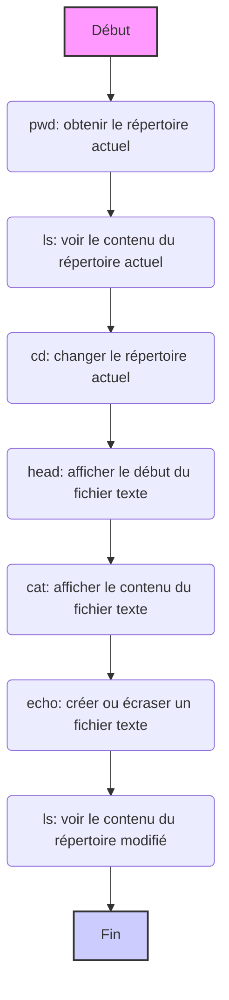

Qu'est-ce que Google Colab ?

Google Colab est une plateforme basée sur le cloud, créée par Google, pour travailler avec des carnets Jupyter Notebook interactifs.
Elle fournit des outils puissants pour écrire et exécuter du code Python, analyser des données, entraîner des modèles d'apprentissage automatique et collaborer sur des projets.

Colab donne accès à de puissantes ressources de calcul, y compris des unités de traitement graphique (GPU) et des unités de traitement tensoriel (TPU).
Cela permet de résoudre des problèmes complexes, tels que le traitement de grands ensembles de données ou l'entraînement de réseaux neuronaux, sans avoir à acheter du matériel coûteux. Colab est construit sur Jupyter Notebook, offrant une interface pratique pour travailler avec du code, du texte et des visualisations. Vous pouvez exécuter des cellules de code, insérer du texte explicatif, créer des graphiques et des visualisations directement dans votre navigateur. Vous pouvez utiliser Colab immédiatement après l'avoir ouvert. Il n'est pas nécessaire d'installer des programmes, des bibliothèques ou des pilotes supplémentaires. Tout est déjà configuré pour fonctionner. Vous pouvez connecter votre Google Drive, ce qui vous permet de télécharger facilement des données, d'enregistrer des projets et d'accéder aux fichiers depuis n'importe où. Colab prend en charge le travail collaboratif. Vous pouvez partager vos projets avec des collègues, modifier des carnets simultanément et discuter des modifications en temps réel.


### Comment fonctionne Google Colab ?
- Vous lancez un carnet Jupyter dans le navigateur, ce qui vous évite d'avoir à installer un environnement local.
- Le code est exécuté sur des serveurs Google distants, et les résultats sont affichés dans votre carnet.
- Les données peuvent être téléchargées depuis un appareil local ou depuis le cloud, tel que Google Drive.
- Vous pouvez utiliser Colab pour écrire du code Python, travailler avec des bibliothèques d'apprentissage automatique (par exemple, TensorFlow, PyTorch), analyser des données à l'aide de Pandas ou créer des visualisations via Matplotlib et Seaborn.


À quoi ressemble Google Colab ?


L'interface de Colab se compose de plusieurs parties principales :

Cellules de code : Ce sont les cellules dans lesquelles vous écrirez et exécuterez votre code Python.

Cellules de texte : Ici, vous pouvez ajouter des descriptions, des explications et des notes à votre code.

Menu : En haut, il y a un menu avec diverses options pour travailler avec le carnet (fichier, édition, affichage, outils, etc.).

Gestionnaire de fichiers : Sur la gauche, il y a un panneau de gestionnaire de fichiers où vous pouvez afficher les fichiers et les dossiers dans votre environnement Colab.


Dans Google Colab, vous travaillez dans un environnement cloud,
où le système de fichiers est organisé comme sur un ordinateur normal avec des dossiers et des fichiers.
Colab fournit des outils pour naviguer, créer, afficher et modifier des fichiers.
Vous pouvez interagir avec le système de fichiers à l'aide des **commandes magiques de Jupyter** (commençant par `%`)
et des **commandes bash** (commençant par `!`).

**Liste des commandes de base :**

1.  **`%pwd`** (print working directory) :
    *   **Description** : Affiche le répertoire de travail actuel (où vous vous trouvez actuellement dans le système de fichiers).
    *   **Exemple** : `%pwd`
    *   **Résultat** : `/content` (ou un autre répertoire actuel)

2.  **`%ls`** (list) :
    *   **Description** : Liste les fichiers et les dossiers du répertoire actuel.
    *   **Exemple** : `%ls`
    *   **Résultat** : Liste des fichiers et des dossiers, par exemple : `sample_data/  my_file.txt`

3.  **`%cd <chemin>`** (change directory) :
    *   **Description** : Change le répertoire spécifié.
    *   **Exemple** : `%cd sample_data`
    *   **Résultat** : Le répertoire de travail actuel passe à `/content/sample_data`

4.  **`!head -<nombre de lignes> <nom de fichier>`** :
    *   **Description** : Affiche les premières lignes du fichier texte spécifié.
    *   **Exemple** : `!head -5 README.md`
    *   **Résultat** : Les 5 premières lignes du fichier `README.md`.

5.  **`!cat <nom de fichier>`** :
    *   **Description** : Affiche le contenu du fichier texte spécifié.
    *   **Exemple** : `!cat sample_file.txt`
    *   **Résultat** : Tout le contenu du fichier `sample_file.txt`.

6.   **`!echo "<texte>" > <nom de fichier>`**
    *   **Description :** Crée un nouveau fichier avec le nom spécifié et y écrit du texte. Si le fichier existe déjà, il sera écrasé
    *   **Exemple :** `!echo "Ceci est mon nouveau fichier !" > new_file.txt`
    *   **Résultat :** Crée `new_file.txt` avec le contenu `Ceci est mon nouveau fichier !`. 

**Points clés :**

*   **Commandes magiques** (`%`) - ce sont des commandes Jupyter spéciales pour travailler avec l'environnement Colab.
*   **Commandes bash** (`!`) - ce sont des commandes qui sont exécutées dans la ligne de commande Linux.
*   **Chemin du fichier** : Le chemin du fichier indique exactement où le fichier se trouve dans le système de fichiers (par exemple, `/content/sample_data/my_file.txt`).
*   **Répertoire actuel** : Votre position dans le système de fichiers (modifiée par la commande `%cd`).

**Diagramme illustrant la séquence de commandes :**



**Téléchargement de fichiers vers Google Colab**

Il existe plusieurs façons de télécharger des fichiers vers Colab, et nous examinerons les plus courantes.

1.  **Téléchargement via le gestionnaire de fichiers (GUI)**
    *   **Description :** Le moyen le plus simple de télécharger des fichiers, en particulier les petits, est d'utiliser l'interface graphique du gestionnaire de fichiers de Colab.
    *   **Comment faire :**
        1.  Ouvrez le panneau du gestionnaire de fichiers à gauche (icône de dossier).
        2.  Cliquez sur l'icône de téléchargement (généralement un signe plus ou une flèche vers le haut).
        3.  Dans la fenêtre qui s'ouvre, sélectionnez les fichiers sur votre ordinateur que vous souhaitez télécharger.
        4.  Cliquez sur "Ouvrir" ou "Télécharger".
    *   **Avantages :** Simplicité, clarté, aucun code requis.
    *   **Inconvénients :** Convient aux petits fichiers, doit être fait manuellement.


2.  **Téléchargement via le code Python (`google.colab.files.upload()`)**
    *   **Description**: Cette méthode vous permet de télécharger des fichiers à l'aide du code Python, ce qui offre plus de flexibilité.
    *   **Comment faire :**
        1.  Importez le module `files` de la bibliothèque `google.colab`.
           ```python
           from google.colab import files
           ```
        2.  Appelez la fonction `files.upload()`
             ```python
             uploaded = files.upload()
             ```
        3.  Lorsque vous exécutez ce code, une boîte de dialogue apparaîtra où vous pourrez sélectionner les fichiers à télécharger.
    *   **Avantages :** Peut être utilisé dans le code, permet le traitement programmatique des fichiers téléchargés.
    *   **Inconvénients :** Nécessite l'écriture de code, légèrement moins intuitif que le gestionnaire de fichiers.

    Après l'exécution de ce code, les fichiers téléchargés seront disponibles sous la forme d'un dictionnaire `uploaded`, où les clés sont les noms de fichiers et les valeurs sont leur contenu sous forme de chaînes d'octets.
    ```python
    # Exemple d'utilisation des fichiers téléchargés
    for file_name, file_data in uploaded.items():
       print(f"Fichier : {file_name}")
       # Traitement des données du fichier
       # Par exemple :
       # import pandas as pd
       # df = pd.read_csv(io.BytesIO(file_data))
       # print(df.head())
    ```


3.  **Clonage d'un dépôt GitHub (`git clone`)**
    *   **Description**: Si vos fichiers se trouvent dans un dépôt GitHub, vous pouvez les télécharger en clonant le dépôt dans Colab.
    *   **Comment faire :**
        1.  Utilisez la commande `git clone` avec l'URL du dépôt.
            ```python
            !git clone <URL_du_dépôt>
            ```
            Par exemple :
           ```python
           !git clone https://github.com/username/my_repository.git
           ```
        2. Après le clonage du dépôt, le contenu sera disponible dans un dossier portant le même nom que le dépôt.
    *   **Avantages :** Facile de télécharger tous les fichiers d'un dépôt, moyen pratique pour les projets avec contrôle de version.
    *   **Inconvénients :** Ne convient qu'aux fichiers des dépôts GitHub.


   ```html
<div align="center">
  
  <p><em>Clonage du dépôt GitHub dans Colab</em></p>
</div>
```

4.  **Téléchargement d'un seul fichier depuis GitHub**
     *   **Description**: Si vous n'avez besoin que d'un ou de quelques fichiers d'un dépôt GitHub, vous pouvez les télécharger directement.
     *   **Comment faire :**
         1.  Ouvrez le fichier souhaité dans le dépôt GitHub.
         2.  Cliquez sur le bouton "Afficher le brut".
         3.  Copiez l'URL de ce fichier.
        4.  Utilisez `wget` ou `curl` pour télécharger le fichier.
            ```python
            !wget <URL_du_fichier>
            ```
           ou
             ```python
            !curl <URL_du_fichier> -o <nom_de_fichier_dans_colab>
             ```
    *   **Avantages** : Facile de télécharger uniquement les fichiers nécessaires, sans cloner tout le dépôt.
    *   **Inconvénients** : Nécessite de connaître le lien direct vers le fichier.


**Quelle méthode choisir ?**

*   Pour les petits fichiers qui doivent être téléchargés rapidement et manuellement, le **gestionnaire de fichiers** est adapté.
*   Si vous devez traiter des fichiers téléchargés par programme, utilisez **`files.upload()`**.
*   Pour télécharger des projets entiers, utilisez **`git clone`**.
*  Pour télécharger des fichiers individuels, utilisez **`wget` ou `curl`**
