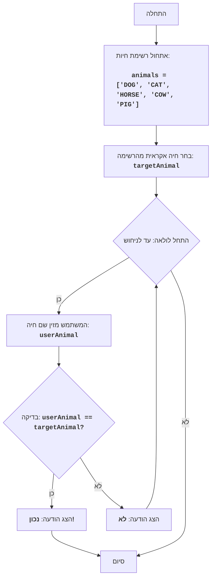

ANIMAL:
=================
קושי: 4
-----------------
המשחק "ANIMAL" - זהו משחק ניחוש חיות, שבו המחשב בוחר חיה אקראית מתוך רשימה, והשחקן מנסה לנחש אותה, על ידי הזנת ניחושיו. המשחק נמשך עד שהשחקן מנחש את החיה.

כללי המשחק:
1.  המחשב בוחר חיה אקראית מתוך רשימה מוגדרת מראש.
2.  השחקן מזין את ניחושיו לגבי החיה הנסתרת.
3.  לאחר כל ניסיון, המחשב מודיע אם השחקן ניחש את החיה או לא.
4.  המשחק נמשך עד שהשחקן מנחש את החיה הנסתרת.
-----------------
אלגוריתם:
1.  הגדר רשימת חיות.
2.  בחר חיה אקראית מהרשימה.
3.  התחל לולאה "כל עוד החיה לא נוחשה":
    3.1 בקש מהשחקן להזין את שם החיה.
    3.2 אם השם שהוזן תואם לחיה הנסתרת, עבור לשלב 4.
    3.3 אחרת, הצג הודעה "לא".
4. הצג הודעה "נכון!".
5. סיום המשחק.
-----------------
תרשים זרימה:

מקרא:
    Start - התחלת התוכנית.
    InitializeAnimals - אתחול רשימת החיות.
    ChooseRandomAnimal - בחירת חיה אקראית מהרשימה ושמירתה במשתנה targetAnimal.
    LoopStart - התחלת הלולאה, הנמשכת עד שהחיה נוחשה.
    InputAnimal - בקשת המשתמש להזין את שם החיה ושמירתו במשתנה userAnimal.
    CheckAnimal - בדיקה האם שם החיה שהוזן userAnimal תואם לחיה הנסתרת targetAnimal.
    OutputWin - הצגת הודעת ניצחון אם שמות החיות תואמים.
    End - סיום התוכנית.
    OutputWrong - הצגת הודעה "לא" אם שם החיה שהוזן אינו תואם לחיה הנסתרת.

import random

# רשימת חיות למשחק
animals = ['DOG', 'CAT', 'HORSE', 'COW', 'PIG']

# בחר חיה אקראית מהרשימה
targetAnimal = random.choice(animals)

# התחל את הלולאה עד שהחיה נוחשה
while True:
    # בקש מהמשתמש להזין את שם החיה
    userAnimal = input("נחש את החיה (DOG, CAT, HORSE, COW, PIG): ").upper()

    # בדוק אם המשתמש ניחש את החיה
    if userAnimal == targetAnimal:
        print("נכון!") # הצג הודעה נכונה
        break # סיים את הלולאה אם החיה נוחשה
    else:
        print("לא") # הצג הודעה שגויה

הסבר קוד:

1.  **ייבוא מודול `random`**:
    -   `import random`: מייבא את מודול `random`, המשמש לבחירה אקראית של חיה.

2.  **רשימת חיות**:
    -   `animals = ['DOG', 'CAT', 'HORSE', 'COW', 'PIG']`: יוצר רשימת מחרוזות עם שמות חיות.

3.  **בחירת חיה אקראית**:
    -   `targetAnimal = random.choice(animals)`: בוחר חיה אקראית מהרשימה `animals` ושומר אותה במשתנה `targetAnimal`.

4.  **לולאת המשחק הראשית `while True:`**:
    -   לולאה אינסופית הנמשכת עד שהשחקן מנחש את החיה.
    -   **קלט**:
        -   `userAnimal = input("נחש את החיה (DOG, CAT, HORSE, COW, PIG): ").upper()`: מבקש מהמשתמש להזין את שם החיה וממיר אותו לאותיות גדולות לצורך השוואה ללא תלות ברישיות.
    -   **תנאי ניצחון**:
        -   `if userAnimal == targetAnimal:`: בודק אם שם החיה שהוזן על ידי המשתמש תואם לחיה הנסתרת.
        -   `print("נכון!")`: מציג הודעת ניצחון אם החיה נוחשה.
        -   `break`: מסיים את הלולאה (ואת המשחק) אם החיה נוחשה.
    -   **הודעת תשובה שגויה**:
        -   `else:`: מבוצע אם שם החיה שהוזן אינו תואם לחיה הנסתרת.
        -   `print("לא")`: מציג הודעה "לא" אם התשובה שגויה.