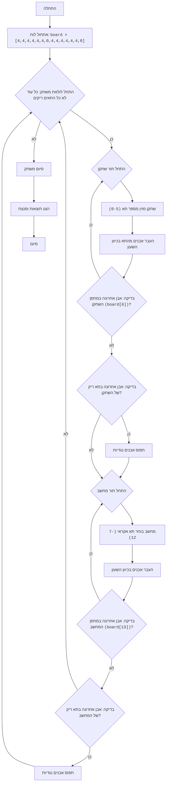

AWARI:
=================
קושי: 6
-----------------
המשחק "אוארי" - זהו משחק לוח המדמה את המשחק המסורתי מנקלה, שבו שני שחקנים מעבירים בתורם "אבנים" (במקרה זה, מספרים) מתאים על הלוח, ומנסים לתפוס כמה שיותר אבנים ל"מחסנים" שלהם. זוהי גרסה פשוטה של המשחק שבה השחקן משחק נגד המחשב.

כללי המשחק:
1. לוח המשחק מורכב מ-14 תאים, ממוספרים מ-0 עד 13. תאים 6 ו-13 הם "מחסני" השחקנים.
2. בתחילת המשחק, בכל אחד מ-12 התאים (0-5 ו-7-12) נמצאות 4 אבנים.
3. השחקן (אדם) מתחיל את המשחק.
4. בוחר תא עם האבנים שלו (0-5).
5. כל האבנים מהתא הנבחר מועברות אחת אחת לכל תא הבא בכיוון השעון, כולל ה"מחסן" שלו.
6. אם האבן האחרונה נחתה במחסן השחקן, השחקן זכאי למהלך נוסף.
7. אם האבן האחרונה נחתה בתא ריק בצד השחקן, ומול תא זה יש אבנים, אז השחקן לוקח את האבנים מתא זה ומהתא הנגדי למחסן שלו.
8. המחשב זז באופן דומה.
9. המשחק מסתיים כאשר כל התאים עם אבנים מתרוקנים.
10. השחקן עם יותר אבנים במחסן שלו מנצח.
-----------------
אלגוריתם:
1. אתחל את הלוח (מערך) של 14 תאים עם 4 אבנים בכל אחד, למעט תאים 6 ו-13, שהם 0.
2. התחל לולאה "כל עוד המשחק לא נגמר"
3. תור השחקן:
    3.1 בקש קלט מספר תא מהשחקן (0 עד 5).
    3.2 העבר אבנים מהתא הנבחר בכיוון השעון.
    3.3 בדוק אם האבן האחרונה נחתה במחסן השחקן (תא 6). אם כן, תן לשחקן תור נוסף.
    3.4 בדוק אם האבן האחרונה נחתה בתא ריק בצד השחקן. אם כן, תפוס אבנים מתא זה ומהתא הנגדי.
4. תור המחשב (בדומה לתור השחקן, אך בחירת התא אקראית מ-7 עד 12).
5. אם כל התאים עם אבנים ריקים, סיים את המשחק.
6. הצג את התוצאה (מספר האבנים במחסני השחקן והמחשב).
7. קבע את המנצח (למי יש יותר אבנים במחסן).
-----------------
תרשים זרימה:

מקרא:
   Start - התחלת התוכנית.
    InitializeBoard - אתחול לוח המשחק עם 14 תאים. 6 הראשונים (0-5) ו-6 האחרונים (7-12) מייצגים תאים עם אבנים, 6 ו-13 הם מחסני השחקנים.
    GameLoopStart - התחלת לולאת המשחק, הנמשכת עד שהמשחק נגמר.
    PlayerTurnStart - התחלת תור השחקן.
    PlayerInputCell - בקשת מספר תא מהשחקן שממנו הוא רוצה להעביר אבנים.
    PlayerMoveStones - העברת אבנים מהתא הנבחר בכיוון השעון.
    PlayerCheckExtraTurn - בדיקה אם האבן האחרונה נחתה במחסן השחקן. אם כן, השחקן מקבל תור נוסף.
    PlayerCheckCapture - בדיקה אם האבן האחרונה נחתה בתא ריק בצד השחקן.
    PlayerCaptureStones - תפיסת אבנים מהתא הנגדי אם האבן האחרונה נחתה בתא ריק בצד השחקן.
    ComputerTurnStart - התחלת תור המחשב.
    ComputerSelectCell - המחשב בוחר תא אקראי למהלך שלו.
    ComputerMoveStones - המחשב מעביר אבנים בכיוון השעון.
    ComputerCheckExtraTurn - בדיקה אם האבן האחרונה נחתה במחסן המחשב. אם כן, המחשב מקבל תור נוסף.
    ComputerCheckCapture - בדיקה אם האבן האחרונה נחתה בתא ריק בצד המחשב. אם כן, המחשב תופס אבנים מהתא הנגדי.
    ComputerCaptureStones - תפיסת אבנים מהתא הנגדי אם האבן האחרונה נחתה בתא ריק בצד המחשב.
    EndGame - סיום המשחק.
    OutputResult - הצגת תוצאות וקביעת מנצח.
    End - סיום התוכנית.

import random

# אתחול הלוח.
# תאים 0-5 - תאי השחקן, 6 - מחסן השחקן
# תאים 7-12 - תאי המחשב, 13 - מחסן המחשב
board = [4, 4, 4, 4, 4, 4, 0, 4, 4, 4, 4, 4, 4, 0]

def display_board():
    """מציג את מצב לוח המשחק הנוכחי."""
    print("----------------------------------------------------")
    print(f"  {board[12]:2}  {board[11]:2}  {board[10]:2}  {board[9]:2}  {board[8]:2}  {board[7]:2}   ")
    print("----------------------------------------------------")
    print(f"{board[13]:2}                                 {board[6]:2}")
    print("----------------------------------------------------")
    print(f"  {board[0]:2}  {board[1]:2}  {board[2]:2}  {board[3]:2}  {board[4]:2}  {board[5]:2}  ")
    print("----------------------------------------------------")

def player_turn():
    """מטפל בתור השחקן."""
    while True:
        try:
            cell = int(input("בחר תא (0-5): "))
            if 0 <= cell <= 5 and board[cell] > 0:
                break
            else:
                print("בחירה לא חוקית. בחר תא עם אבנים מ-0 עד 5.")
        except ValueError:
            print("קלט לא חוקי. אנא הכנס מספר.")
    
    stones = board[cell]
    board[cell] = 0
    current_cell = cell
    
    while stones > 0:
        current_cell = (current_cell + 1) % 14
        board[current_cell] += 1
        stones -= 1

    # בדיקה לתור נוסף אם האבן האחרונה נחתה במחסן השחקן
    if current_cell == 6:
        print("השחקן מקבל תור נוסף.")
        display_board()
        player_turn()
        return
        
    # תפיסת אבנים
    if 0 <= current_cell <= 5 and board[current_cell] == 1:
        opposite_cell = 12 - current_cell
        if board[opposite_cell] > 0:
             board[6] += board[opposite_cell] + 1
             board[opposite_cell]=0
             board[current_cell] = 0
             print(f"השחקן תופס אבנים מתאים {current_cell} ו- {opposite_cell}")
         
        
def computer_turn():
    """מטפל בתור המחשב."""
    possible_moves = [i for i in range(7, 13) if board[i] > 0]
    if not possible_moves:
        return  # אם אין מהלכים זמינים למחשב, צא
    
    cell = random.choice(possible_moves)
    print(f"המחשב בוחר תא {cell}")
    stones = board[cell]
    board[cell] = 0
    current_cell = cell

    while stones > 0:
         current_cell = (current_cell + 1) % 14
         board[current_cell] += 1
         stones -= 1

    # בדיקה לתור נוסף אם האבן האחרונה נחתה במחסן המחשב
    if current_cell == 13:
        print("המחשב מקבל תור נוסף.")
        display_board()
        computer_turn()
        return

    # תפיסת אבנים
    if 7 <= current_cell <= 12 and board[current_cell] == 1:
          opposite_cell = 12 - current_cell
          if board[opposite_cell] > 0:
             board[13] += board[opposite_cell] + 1
             board[opposite_cell]=0
             board[current_cell] = 0
             print(f"המחשב תופס אבנים מתאים {current_cell} ו- {opposite_cell}")

def is_game_over():
    """בודק אם המשחק נגמר."""
    player_side_empty = all(board[i] == 0 for i in range(0, 6))
    computer_side_empty = all(board[i] == 0 for i in range(7, 13))
    return player_side_empty or computer_side_empty

def calculate_winner():
    """קובע את המנצח ומציג את התוצאות."""
    player_score = board[6]
    computer_score = board[13]

    print(f"שחקן: {player_score} נקודות")
    print(f"מחשב: {computer_score} נקודות")

    if player_score > computer_score:
        print("ניצחת!")
    elif computer_score > player_score:
        print("המחשב ניצח!")
    else:
        print("תיקו!")

# לולאת המשחק הראשית
while True:
    display_board()
    player_turn()
    if is_game_over():
        break
    display_board()
    computer_turn()
    if is_game_over():
       break
    

# לאחר סיום המשחק
display_board()
calculate_winner()

הסבר קוד:
1. **אתחול הלוח (`board`)**:
   - `board = [4, 4, 4, 4, 4, 4, 0, 4, 4, 4, 4, 4, 4, 0]`: נוצרת רשימה המייצגת את לוח המשחק. 
     6 האלמנטים הראשונים (0-5) - תאי השחקן, 7-12 - תאי המחשב, 6 - מחסן השחקן, 13 - מחסן המחשב. 
     בתחילת המשחק בכל תא יש 4 אבנים, ובמחסנים - 0.

2. **פונקציה `display_board()`**:
   - מציגה את מצב לוח המשחק הנוכחי על המסך.

3. **פונקציה `player_turn()`**:
   - מטפלת בתור השחקן:
     - מבקשת קלט מספר תא (0-5).
     - בודקת תקינות קלט (מספר מ-0 עד 5 ותא לא ריק).
     - לוקחת אבנים מהתא הנבחר.
     - מחלקת אבנים אחת אחת לכל תא הבא בכיוון השעון.
     - בודקת אם האבן האחרונה נחתה במחסן השחקן (תא 6). אם כן, השחקן מקבל תור נוסף.
     - בודקת אם האבן האחרונה נחתה בתא ריק בצד השחקן, אם כן, תופסת אבנים נגדיות.
4. **פונקציה `computer_turn()`**:
   - מטפלת בתור המחשב:
     - בוחרת תא אקראי לא ריק (7-12).
     - מחלקת אבנים אחת אחת לכל תא הבא בכיוון השעון.
     - בודקת אם האבן האחרונה נחתה במחסן המחשב (תא 13). אם כן, המחשב מקבל תור נוסף.
     - בודקת אם האבן האחרונה נחתה בתא ריק בצד המחשב, אם כן, תופסת אבנים נגדיות.

5.  **פונקציה `is_game_over()`**:
    - בודקת אם המשחק נגמר. המשחק נגמר כאשר כל התאים בצד השחקן או המחשב ריקים.
6.  **פונקציה `calculate_winner()`**:
    - מציגה את ציון כל שחקן.
    - קובעת את המנצח.

7.  **לולאת המשחק הראשית (`while True`)**:
    - מציגה את הלוח.
    - נותנת תור לשחקן.
    - בודקת אם המשחק נגמר. אם כן, יוצאת מהלולאה.
    - נותנת תור למחשב.
    - בודקת אם המשחק נגמר. אם כן, יוצאת מהלולאה.

8.  **הצגת תוצאות**:
    - לאחר סיום המשחק, מציגה את הלוח ואת התוצאות.
