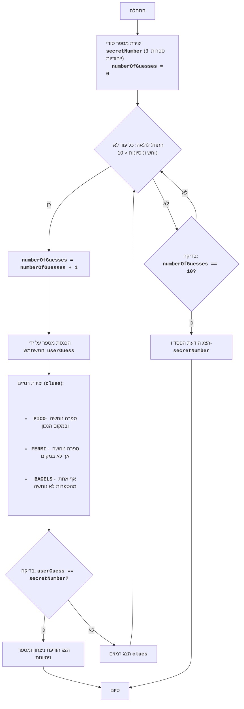

BAGLES:
=================
קושי: 6
-----------------
המשחק "בייגלס" - זהו משחק היגיון-חידה, שבו השחקן מנסה לנחש מספר תלת-ספרתי, המורכב מספרות ייחודיות. לאחר כל ניסיון, השחקן מקבל רמזים: "PICO" פירושו שאחת הספרות נוחשה ונמצאת במיקום הנכון, "FERMI" פירושו שאחת הספרות נוחשה, אך לא במיקום הנכון, "BAGELS" פירושו שאף אחת מהספרות לא נוחשה.

כללי המשחק:
1. המחשב מייצר מספר תלת-ספרתי אקראי המורכב מספרות ייחודיות.
2. השחקן מזין את ניחושיו כמספר תלת-ספרתי.
3. המחשב מספק רמזים:
    - "PICO" - ספרה אחת נוחשה ונמצאת במיקום הנכון.
    - "FERMI" - ספרה אחת נוחשה, אך לא במיקום הנכון.
    - "BAGELS" - אף אחת מהספרות לא נוחשה.
4. רמזים ניתנים בסדר מיקום הספרות במספר הנסתר, לדוגמה אם המספר הנסתר הוא `123` והשחקן הזין `142`, אז הרמזים יהיו `PICO FERMI`.
5. המשחק נמשך עד שהשחקן מנחש את המספר.
6. אם לאחר 10 ניסיונות השחקן לא מנחש את המספר, המשחק מסתיים והמספר הנסתר מוצג.
-----------------
אלגוריתם:
1. צור מספר תלת-ספרתי אקראי, המורכב מספרות ייחודיות (לדוגמה, 123).
2. הגדר את מספר הניסיונות ל-0.
3. לולאה "כל עוד המספר לא נוחש או מספר הניסיונות קטן מ-10":
    3.1. הגדל את מספר הניסיונות ב-1.
    3.2. בקש מהשחקן מספר תלת-ספרתי.
    3.3. השווה את המספר שהוזן למספר הנסתר וצור רמזים "PICO", "FERMI" ו-"BAGELS".
    3.4. אם המספר נוחש, הצג הודעת ניצחון ומספר ניסיונות.
    3.5. אם המספר לא נוחש, הצג את הרמזים שנוצרו.
4. אם לאחר 10 ניסיונות המספר לא נוחש, הצג את המספר הנסתר והודעת הפסד.
5. סיום המשחק.
-----------------
תרשים זרימה:

מקרא:
    Start - התחלת המשחק.
    GenerateSecretNumber - יצירת מספר סודי secretNumber מ-3 ספרות ייחודיות ואתחול מספר הניסיונות numberOfGuesses = 0.
    LoopStart - התחלת הלולאה, הנמשכת כל עוד המספר לא נוחש ומספר הניסיונות קטן מ-10.
    IncreaseGuesses - הגדלת מונה הניסיונות ב-1.
    InputGuess - בקשת המשתמש להזין מספר ושמירתו במשתנה userGuess.
    GenerateClues - יצירת רמזים על בסיס השוואת userGuess ו-secretNumber.
    CheckWin - בדיקה האם המספר שהוזן userGuess שווה למספר הסודי secretNumber.
    OutputWin - הצגת הודעת ניצחון ומספר ניסיונות.
    End - סיום המשחק.
    OutputClues - הצגת הרמזים שנוצרו.
    CheckLose - בדיקה האם מספר הניסיונות הגיע ל-10.
    OutputLose - הצגת הודעת הפסד והמספר הסודי secretNumber.
