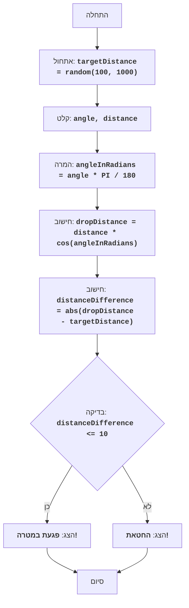

BOMBER:
=================
קושי: 5
-----------------
המשחק "בומבר" - זהו משחק פאזל שבו השחקן מנסה להפיל פצצה על מטרה הממוקמת במרחק שנוצר באופן אקראי. השחקן מזין את זווית ההטלה ואת מרחק ההטלה, והמחשב מחשב את מסלול הפצצה. מטרת המשחק - לפגוע במטרה בצורה מדויקת ככל האפשר.

כללי המשחק:
1. המחשב מייצר מרחק מטרה אקראי בטווח של 100 עד 1000.
2. השחקן מזין את זווית הטלת הפצצה ואת מרחק הטלת הפצצה.
3. המחשב מחשב את המרחק שאליו תיפול הפצצה.
4. אם מרחק נפילת הפצצה נמצא בטווח של 10 יחידות ממרחק המטרה, השחקן מנצח.
5. אם מרחק נפילת הפצצה אינו בטווח, השחקן מפסיד.
-----------------
אלגוריתם:
1. צור מרחק מטרה אקראי בטווח של 100 עד 1000 והקצה אותו למשתנה `targetDistance`.
2. בקש מהשחקן את זווית הטלת הפצצה במעלות (זווית) ואת מרחק ההטלה (מרחק).
3. המר את הזווית ממעלות לרדיאנים `angleInRadians = angle * 3.14159 / 180`.
4. חשב את מרחק נפילת הפצצה לפי הנוסחה: `dropDistance = distance * cos(angleInRadians)`.
5. חשב את ההפרש בין מרחק נפילת הפצצה למרחק המטרה: `distanceDifference = abs(dropDistance - targetDistance)`.
6. אם הפרש המרחקים קטן או שווה ל-10, הצג הודעת ניצחון.
7. אחרת, הצג הודעת הפסד.
8. סיום המשחק.
-----------------
תרשים זרימה:

מקרא:
   Start - התחלת התוכנית.
    InitializeTargetDistance - אתחול: נוצר מרחק מטרה אקראי (targetDistance) מ-100 עד 1000.
    InputAngleDistance - בקשת המשתמש להזין את זווית ההטלה (angle) ואת מרחק ההטלה (distance).
    ConvertAngle - המרת הזווית ממעלות לרדיאנים (angleInRadians).
    CalculateDropDistance - חישוב מרחק נפילת הפצצה (dropDistance) על בסיס הנתונים שהוזנו.
    CalculateDistanceDifference - חישוב ההפרש המוחלט בין מרחק נפילת הפצצה (dropDistance) למרחק המטרה (targetDistance).
    CheckDistanceDifference - בדיקה האם הפרש המרחקים נמצא בטווח של 10 יחידות (distanceDifference <= 10).
    OutputWin - הצגת הודעת ניצחון אם ההפרש נמצא בטווח של 10 יחידות.
    End - סיום התוכנית.
    OutputLose - הצגת הודעת הפסד אם ההפרש גדול מ-10 יחידות.