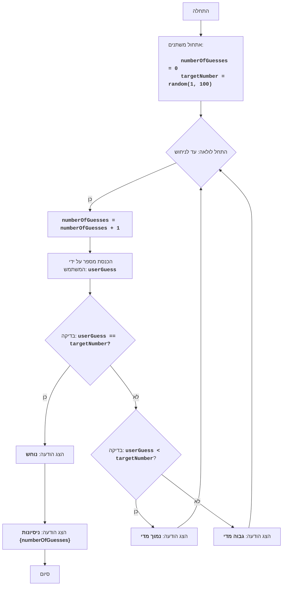

BUZZWD:
=================
קושי: 4
-----------------
המשחק "BUZZWD" מייצג משחק מספרים פשוט, שבו המחשב מייצר מספר אקראי, והשחקן צריך לנחש אותו, על ידי הזנת מספרים בתורו. לאחר כל קלט, התוכנית מדווחת האם המספר שהוזן "גבוה מדי", "נמוך מדי" או שהוא נוחש. המשחק מסתיים כאשר השחקן מנחש נכון את המספר.

כללי המשחק:
1. המחשב בוחר מספר שלם אקראי מ-1 עד 100.
2. השחקן מזין את ניחושיו לגבי המספר הנסתר.
3. לאחר כל ניסיון, המחשב מדווח האם המספר שהוזן היה נמוך מדי, גבוה מדי או נוחש.
4. המשחק נמשך עד שהשחקן מנחש את המספר הנסתר.
-----------------
אלגוריתם:
1.  הגדר את מונה הניסיונות ל-0.
2.  צור מספר אקראי בטווח של 1 עד 100.
3.  התחל לולאה "כל עוד המספר לא נוחש":
    3.1 הגדל את מונה הניסיונות ב-1.
    3.2 בקש מהשחקן להזין מספר.
    3.3 אם המספר שהוזן שווה למספר הנסתר, הצג הודעה "נוחש" ועבור לשלב 4.
    3.4 אם המספר שהוזן קטן מהמספר הנסתר, הצג הודעה "נמוך מדי".
    3.5 אם המספר שהוזן גדול מהמספר הנסתר, הצג הודעה "גבוה מדי".
4. הצג הודעה "ניסיונות {מונה ניסיונות}"
5. סיום המשחק.
-----------------
תרשים זרימה:

מקרא:
    Start - התחלת התוכנית.
    InitializeVariables - אתחול משתנים: numberOfGuesses (מונה ניסיונות) מוגדר ל-0, ו-targetNumber (מספר נסתר) נוצר באופן אקראי מ-1 עד 100.
    LoopStart - התחלת הלולאה, הנמשכת עד שהמספר נוחש.
    IncreaseGuesses - הגדלת מונה הניסיונות ב-1.
    InputGuess - בקשת המשתמש להזין מספר ושמירתו במשתנה userGuess.
    CheckGuess - בדיקה האם המספר שהוזן userGuess שווה למספר הנסתר targetNumber.
    OutputWin - הצגת הודעה "נוחש" אם המספרים שווים.
    OutputAttempts - הצגת הודעה "ניסיונות {numberOfGuesses}", המציינת את מספר הניסיונות.
    End - סיום התוכנית.
    CheckLow - בדיקה האם המספר שהוזן userGuess קטן מהמספר הנסתר targetNumber.
    OutputLow - הצגת הודעה "נמוך מדי" אם המספר שהוזן קטן מהמספר הנסתר.
    OutputHigh - הצגת הודעה "גבוה מדי" אם המספר שהוזן גדול מהמספר הנסתר.