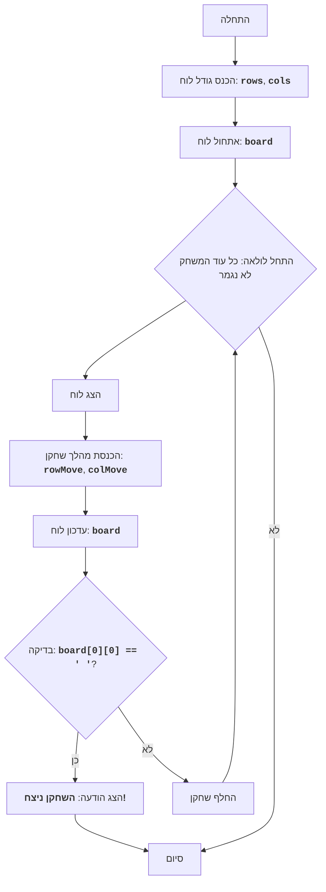

CHOMP:
=================
קושי: 5
-----------------
המשחק "CHOMP" - זהו משחק לשני שחקנים, שבו משתמשים בלוח מלבני, המייצג טבלת שוקולד. 
אחת הפינות (בדרך כלל התחתונה השמאלית) מייצגת "ריבוע" רעיל. שחקנים בתורם שוברים חתיכות מהטבלה, ומבצעים מהלכים. מטרת המשחק - לגרום ליריב לאכול את הריבוע המורעל.
השחקן שנאלץ לאכול את הריבוע המורעל, מפסיד.
כללי המשחק:
1. לוח המשחק מייצג טבלת שוקולד מלבנית.
2. אחת הפינות (התחתונה השמאלית) נחשבת מורעלת.
3. שחקנים בתורם נוגסים חלק מטבלת השוקולד.
4. השחקן בוחר שורה ועמודה (נוגס חתיכת שוקולד).
5. כל התאים מימין ומעל המיקום הנבחר נמחקים.
6. המטרה - לגרום ליריב לאכול את הריבוע המורעל.
7. השחקן שאוכל את הריבוע המורעל, מפסיד.
-----------------
אלגוריתם:
1.  התחלת המשחק.
2.  בקש מהמשתמש את גודל טבלת השוקולד (מספר שורות ועמודות).
3.  אתחל את לוח המשחק, המייצג את טבלת השוקולד.
4.  התחל את לולאת המשחק, כל עוד המשחק לא נגמר:
    4.1.  הצג את מצב הלוח הנוכחי על המסך.
    4.2.  בקש מהשחקן הנוכחי את קואורדינטות חתיכת השוקולד שיש לנגוס.
    4.3.  עדכן את מצב הלוח, על ידי נגיסת החתיכה הנבחרת.
    4.4.  בדוק האם השחקן הנוכחי אכל את הריבוע המורעל.
    4.5.  אם כן, הכרז על ניצחון השחקן הנגדי וסיים את המשחק.
    4.6.  העבר את התור לשחקן הבא.
5. סיום המשחק.
-----------------
תרשים זרימה:

מקרא:
    Start - התחלת המשחק.
    InputBoardSize - בקשת גודל הלוח (מספר שורות ועמודות).
    InitializeBoard - אתחול לוח המשחק.
    LoopStart - התחלת לולאת המשחק, הנמשכת כל עוד המשחק לא נגמר.
    DisplayBoard - הצגת מצב הלוח הנוכחי על המסך.
    InputMove - בקשת קואורדינטות חתיכת השוקולד שיש לנגוס מהשחקן הנוכחי.
    UpdateBoard - עדכון מצב הלוח לאחר מהלך השחקן.
    CheckWin - בדיקה האם השחקן הנוכחי אכל את הריבוע המורעל.
    OutputWinner - הצגת הודעה על ניצחון השחקן השני.
    End - סיום המשחק.
    SwitchPlayer - העברת התור לשחקן הבא.