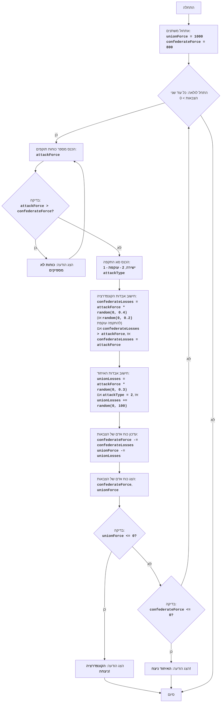

CIVILW:
=================
קושי: 7
-----------------
המשחק "מלחמת אזרחים" מייצג סימולציה של קרב בין שני צבאות: הקונפדרציה והאיחוד. השחקן שולט בקונפדרציה ומקבל החלטות לגבי גודל כוחותיו וסוגי ההתקפות (התקפה ישירה או תמרון עוקף). מטרת המשחק - להביס את צבא האיחוד, תוך מזעור אבדותיו. המשחק לוקח בחשבון גורמים אקראיים המשפיעים על תוצאות הקרב, מה שהופך כל קרב לייחודי.

כללי המשחק:
1.  השחקן שולט בצבא הקונפדרציה וחייב להביס את צבא האיחוד.
2.  השחקן מזין את מספר החיילים לשליחה להתקפה.
3.  השחקן בוחר את סוג ההתקפה: ישירה (1) או עוקפת (2).
4.  בהתאם לבחירת השחקן ולגורמים אקראיים, מחושבים אבדות לשני הצדדים.
5.  לאחר כל קרב, המשחק מציג את כוח האדם הנוכחי של שני הצדדים.
6.  המשחק מסתיים בניצחון של אחד הצדדים, כאשר כוח האדם של היריב שווה או קטן מ-0.
-----------------
אלגוריתם:
1. הגדר את כוח האדם ההתחלתי של צבא האיחוד (UnionForce) ל-1000 ושל צבא הקונפדרציה (ConfederateForce) ל-800.
2. התחל לולאה "כל עוד לשני הצבאות יש כוח אדם גדול מ-0":
    2.1. בקש מהשחקן את מספר החיילים שהוא רוצה לשלוח להתקפה (AttackForce).
        2.1.1. אם AttackForce גדול מכוחות הקונפדרציה הזמינים (ConfederateForce), הצג הודעה "כוחות לא מספיקים" וחזור לתחילת שלב 2.1.
    2.2. בקש מהשחקן את סוג ההתקפה: ישירה (1) או עוקפת (2) (AttackType).
    2.3. חשב את אבדות הקונפדרציה (ConfederateLosses) באופן אקראי, על ידי הכפלת AttackForce במספר אקראי מ-0 עד 0.4 (להתקפה ישירה) או במספר אקראי מ-0 עד 0.2 (לתמרון עוקף).
        2.3.1. אם ConfederateLosses גדול מ-AttackForce, הגדר את ConfederateLosses שווה ל-AttackForce.
    2.4. חשב את אבדות האיחוד (UnionLosses) באופן אקראי, על ידי הכפלת AttackForce במספר אקראי מ-0 עד 0.3.
        2.4.1. אם AttackType שווה ל-2, הגדל את UnionLosses במספר אקראי מ-0 עד 100.
    2.5. עדכן את כוח האדם של הצבאות:
        ConfederateForce = ConfederateForce - ConfederateLosses
        UnionForce = UnionForce - UnionLosses
    2.6. הצג את כוח האדם הנוכחי של שני הצדדים.
    2.7. בדוק תנאי ניצחון:
        2.7.1. אם UnionForce קטן או שווה ל-0, הצג הודעה "הקונפדרציה ניצחה!" וסיים את המשחק.
        2.7.2. אם ConfederateForce קטן או שווה ל-0, הצג הודעה "האיחוד ניצח!" וסיים את המשחק.
3. סיום המשחק.
-----------------
תרשים זרימה:

    
מקרא:
    Start - התחלת התוכנית.
    InitializeForces - אתחול כוח האדם ההתחלתי של צבא האיחוד (unionForce = 1000) ושל הקונפדרציה (confederateForce = 800).
    LoopStart - התחלת הלולאה, הנמשכת כל עוד לשני הצבאות יש כוח אדם גדול מ-0.
    InputAttackForce - בקשת המשתמש את מספר החיילים להתקפה (attackForce).
    CheckForce - בדיקה האם לקונפדרציה יש מספיק כוחות להתקפה (attackForce > confederateForce).
    OutputInsufficient - הצגת הודעה "כוחות לא מספיקים", אם כוחות התוקפים גדולים מכוחות הזמינים.
    InputAttackType - בקשת המשתמש לבחור את סוג ההתקפה: ישירה (1) או עוקפת (2).
    CalculateConfederateLosses - חישוב אבדות הקונפדרציה (confederateLosses) על בסיס attackForce וסוג ההתקפה, תוך התחשבות בגורם אקראי. אם האבדות עולות על attackForce, האבדות מוגדרות שוות ל-attackForce.
    CalculateUnionLosses - חישוב אבדות האיחוד (unionLosses) על בסיס attackForce וסוג ההתקפה, תוך התחשבות בגורם אקראי. בהתקפה עוקפת, אבדות האיחוד גדלות בנוסף במספר אקראי.
    UpdateForces - עדכון כוח האדם של שני הצבאות לאחר הקרב.
    OutputForces - הצגת כוח האדם הנוכחי של צבאות הקונפדרציה והאיחוד.
    CheckUnionWin - בדיקה האם הקונפדרציה ניצחה (כוח האדם של צבא האיחוד <= 0).
    OutputConfederateWin - הצגת הודעה על ניצחון הקונפדרציה.
    CheckConfederateWin - בדיקה האם האיחוד ניצח (כוח האדם של צבא הקונפדרציה <= 0).
    OutputUnionWin - הצגת הודעה על ניצחון האיחוד.
    End - סיום התוכנית.