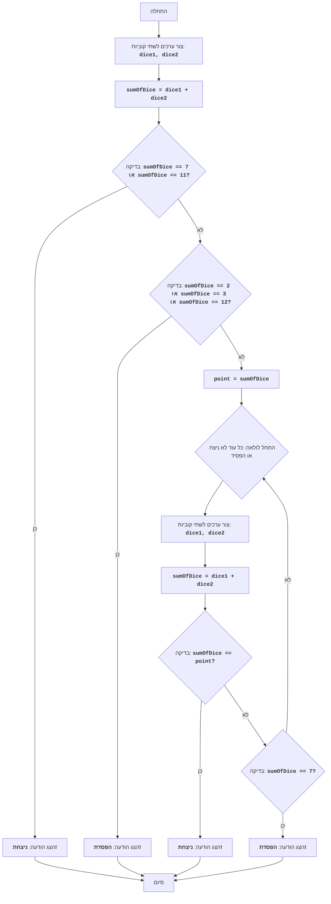

CRAPS:
=================
קושי: 7
-----------------
המשחק "קראפס" - זהו משחק מזל בקובייה, שבו השחקן מהמר על תוצאת הטלת שתי קוביות משחק. בסיבוב הראשון השחקן מנצח אם סכום הנקודות על הקוביות שווה ל-7 או 11, ומפסיד אם הסכום שווה ל-2, 3 או 12. אם סכום הנקודות שווה ל-4, 5, 6, 8, 9 או 10, אז זה הופך ל"מספר היעד" של השחקן, והוא ממשיך להטיל קוביות עד שמספר זה יופיע שוב (במקרה זה השחקן מנצח) או שיופיע 7 (במקרה זה השחקן מפסיד).

כללי המשחק:
1. בתחילת המשחק השחקן מטיל שתי קוביות.
2. אם סכום הנקודות על הקוביות שווה ל-7 או 11, השחקן מנצח.
3. אם סכום הנקודות שווה ל-2, 3 או 12, השחקן מפסיד.
4. אם סכום הנקודות שווה ל-4, 5, 6, 8, 9 או 10, אז מספר זה הופך ל"מספר היעד" (point).
5. לאחר קביעת "מספר היעד", השחקן ממשיך להטיל קוביות עד ש:
   -  יופיע "מספר היעד" שוב, אז השחקן מנצח.
   -  יופיע 7, אז השחקן מפסיד.
-----------------
אלגוריתם:
1. צור ערכים אקראיים לשתי קוביות (מ-1 עד 6).
2. חשב את סכום הערכים שהתקבלו.
3. אם הסכום שווה ל-7 או 11, הצג הודעת ניצחון ועבור לשלב 7.
4. אם הסכום שווה ל-2, 3 או 12, הצג הודעת הפסד ועבור לשלב 7.
5. שמור את הסכום כ"מספר היעד" (point).
6.  התחל לולאה:
    6.1 צור ערכים אקראיים לשתי קוביות.
    6.2 חשב את סכום הערכים שהתקבלו.
    6.3 אם הסכום שווה ל"מספר היעד", הצג הודעת ניצחון ועבור לשלב 7.
    6.4 אם הסכום שווה ל-7, הצג הודעת הפסד ועבור לשלב 7.
    6.5 אחרת, חזור על הלולאה משלב 6.
7. סיום המשחק.
-----------------
תרשים זרימה:

מקרא:
   Start - התחלת התוכנית.
    RollDice1 - יצירת ערכים אקראיים לשתי קוביות משחק (dice1, dice2) בהטלה הראשונה.
    CalculateSum1 - חישוב סכום ערכי dice1 ו-dice2 ושמירת התוצאה במשתנה sumOfDice.
    CheckWin1 - בדיקה האם sumOfDice שווה ל-7 או 11. אם כן, השחקן ניצח.
    OutputWin1 - הצגת הודעה "ניצחת!" וסיום המשחק.
    CheckLose1 - בדיקה האם sumOfDice שווה ל-2, 3 או 12. אם כן, השחקן הפסיד.
    OutputLose1 - הצגת הודעה "הפסדת!" וסיום המשחק.
    SetPoint - אם לא ניצח ולא הפסיד בהטלה הראשונה, sumOfDice נשמר במשתנה point, שהופך ל"מספר היעד".
    LoopStart - התחלת הלולאה הנמשכת עד שהשחקן מנצח או מפסיד.
    RollDice2 - יצירת ערכים אקראיים לשתי קוביות משחק (dice1, dice2) בהטלות הבאות.
    CalculateSum2 - חישוב סכום ערכי dice1 ו-dice2 ושמירת התוצאה במשתנה sumOfDice.
    CheckWin2 - בדיקה האם sumOfDice שווה ל"מספר היעד" point. אם כן, השחקן ניצח.
    OutputWin2 - הצגת הודעה "ניצחת!" וסיום המשחק.
    CheckLose2 - בדיקה האם sumOfDice שווה ל-7. אם כן, השחקן הפסיד.
    OutputLose2 - הצגת הודעה "הפסדת!" וסיום המשחק.
    End - סיום התוכנית.