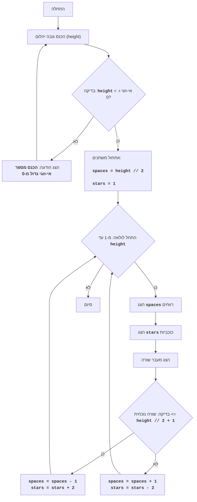

DIAMND:
=================
קושי: 7
-----------------
המשחק DIAMND הוא משחק טקסטואלי שבו השחקן מנסה לצייר יהלום מכוכביות, על ידי קביעת גובהו.
המשחק מבקש תחילה מהמשתמש גובה יהלום אי-זוגי. לאחר מכן, אם המספר שהוזן הוא אי-זוגי, המשחק בונה יהלום מכוכביות, תוך שימוש ברווחים ליצירת הגיאומטריה הנכונה של הצורה. אם המספר שהוזן הוא זוגי או קטן מ-1, מוצגת הודעת שגיאה.
כללי המשחק:
1. השחקן מזין מספר אי-זוגי, הקובע את גובה היהלום.
2. אם הוזן מספר זוגי או מספר קטן מ-1, המשחק מציג הודעת שגיאה.
3. אם הוזן מספר תקין (אי-זוגי וגדול מ-0), המשחק מציג על המסך יהלום מכוכביות בגובה שצוין.
-----------------
אלגוריתם:
1. בקש מהמשתמש להזין את גובה היהלום (H).
2. בדוק האם H זוגי או קטן מ-1. אם כן, הצג הודעת שגיאה ועבור לשלב 1.
3. אם H אי-זוגי וגדול מ-0, אז:
   3.1. הגדר את המשתנה `space` ל-H // 2 (חלוקה שלמה).
   3.2. הגדר את המשתנה `stars` ל-1.
   3.3. התחל לולאה מ-1 עד H כולל:
      3.3.1. הצג `space` רווחים.
      3.3.2. הצג `stars` כוכביות.
      3.3.3. הצג מעבר שורה.
      3.3.4. אם מספר השורה הנוכחי קטן מ-H // 2 + 1:
          3.3.4.1. הקטן את `space` ב-1.
          3.3.4.2. הגדל את `stars` ב-2.
       3.3.5. אחרת:
          3.3.5.1. הגדל את `space` ב-1.
          3.3.5.2. הקטן את `stars` ב-2.
4. סיום המשחק.
-----------------
תרשים זרימה:

מקרא:
    Start - התחלת התוכנית.
    InputHeight - בקשת המשתמש להזין את גובה היהלום ושמירת הערך במשתנה `height`.
    CheckHeight - בדיקה האם הגובה שהוזן הוא מספר אי-זוגי גדול מ-0.
    OutputError - הצגת הודעת שגיאה אם הגובה אינו עומד בתנאי.
    InitializeVars - אתחול משתנים: `spaces` (מספר רווחים) מוגדר ל-`height // 2`, ו-`stars` (מספר כוכביות) מוגדר ל-1.
    LoopStart - התחלת הלולאה, החוזרת על עצמה `height` פעמים.
    OutputSpaces - הצגת `spaces` רווחים.
    OutputStars - הצגת `stars` כוכביות.
    OutputNewline - הצגת תו שורה חדשה.
    CheckRow - בדיקה האם השורה הנוכחית קטנה או שווה למרכז היהלום (`height // 2 + 1`).
    DecreaseSpaceIncreaseStars - הקטנת מספר הרווחים `spaces` ב-1 והגדלת מספר הכוכביות `stars` ב-2.
    IncreaseSpaceDecreaseStars - הגדלת מספר הרווחים `spaces` ב-1 והקטנת מספר הכוכביות `stars` ב-2.
    End - סיום התוכנית.