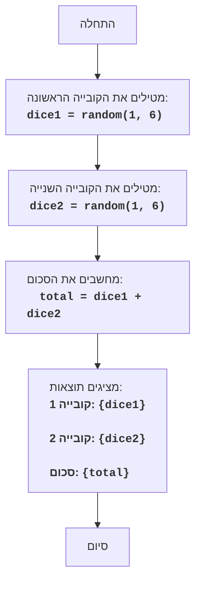

DICE:
=================
קושי: 2
-----------------
המשחק "קוביות" - זהו משחק פשוט, שבו השחקן מטיל שתי קוביות משחק, והמחשב מציג את סכום הערכים שהתקבלו.

כללי המשחק:
1.  המחשב מדמה הטלת שתי קוביות משחק בעלות שישה צדדים.
2.  המחשב מציג על המסך את ערכי כל קובייה ואת סכומם.
-----------------
אלגוריתם:
1.  צור מספר אקראי מ-1 עד 6 עבור הקובייה הראשונה.
2.  צור מספר אקראי מ-1 עד 6 עבור הקובייה השנייה.
3.  חשב את סכום ערכי שתי הקוביות.
4.  הצג על המסך את ערך הקובייה הראשונה, ערך הקובייה השנייה וסכומם.
-----------------
תרשים זרימה:

מקרא:
    Start - התחלת התוכנית.
    RollDice1 - נוצר מספר אקראי מ-1 עד 6, המייצג את תוצאת הטלת הקובייה הראשונה, ונשמר במשתנה dice1.
    RollDice2 - נוצר מספר אקראי מ-1 עד 6, המייצג את תוצאת הטלת הקובייה השנייה, ונשמר במשתנה dice2.
    CalculateSum - מחושב סכום ערכי dice1 ו-dice2, התוצאה נשמרת במשתנה total.
    OutputResults - ערכי dice1, dice2 וסכומם total מוצגים על המסך.
    End - סיום התוכנית.