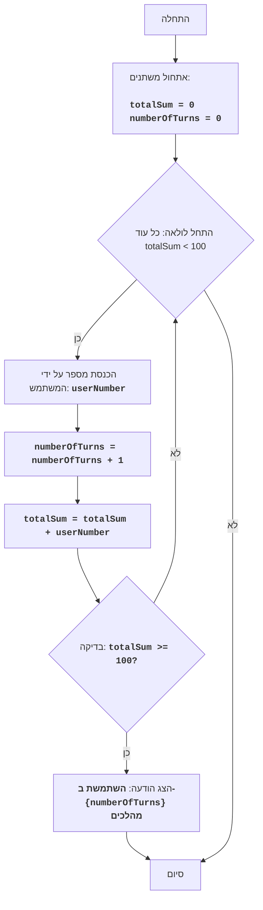

FIPFOP:
=================
קושי: 5
-----------------
המשחק FIPFOP הוא משחק פאזל שבו השחקן צריך, בתורו, להזין מספרים. 
מטרת המשחק - להגיע לכך שכל המספרים שהוזנו על ידי המשתמש, בסכום, יתנו את המספר 100. 
המשחק מסתיים כאשר סכום כל המספרים שהוזנו מגיע ל-100.

כללי המשחק:
1. השחקן מזין מספרים שלמים, אחד בכל פעם.
2. כל מספר שהוזן מתווסף לסכום הכולל.
3. המשחק מסתיים כאשר הסכום הכולל מגיע ל-100.
4. לאחר סיום המשחק, מוצג המספר הכולל של המספרים שהוזנו (מהלכים).
-----------------
אלגוריתם:
1. הגדר את הסכום ל-0.
2. הגדר את מונה המהלכים ל-0.
3. התחל לולאה "כל עוד הסכום קטן מ-100":
    3.1 בקש מהשחקן להזין מספר.
    3.2 הגדל את מונה המהלכים ב-1.
    3.3 הוסף את המספר שהוזן לסכום הכולל.
4. הצג הודעה "השתמשת ב- {מספר מהלכים} מהלכים"
5. סיום המשחק.
-----------------
תרשים זרימה:

מקרא:
    Start - התחלת התוכנית.
    InitializeVariables - אתחול משתנים: totalSum (סכום המספרים שהוזנו) מוגדר ל-0, ו-numberOfTurns (מספר מהלכים) מוגדר ל-0.
    LoopStart - התחלת הלולאה, הנמשכת כל עוד totalSum קטן מ-100.
    InputNumber - בקשת המשתמש להזין מספר ושמירתו במשתנה userNumber.
    IncreaseTurns - הגדלת מונה המהלכים ב-1.
    AddNumber - הוספת המספר שהוזן userNumber לסכום הכולל totalSum.
    CheckSum - בדיקה האם הסכום הכולל totalSum גדול או שווה ל-100.
    OutputTurns - הצגת הודעה על מספר המהלכים שהשתמש בהם המשתמש.
    End - סיום התוכנית.

# אתחול סכום ומונה מהלכים
totalSum = 0 # סכום המספרים שהוזנו
numberOfTurns = 0 # מספר מהלכים

# לולאת המשחק הראשית
while totalSum < 100:
    # בקשת קלט מספר מהמשתמש
    try:
        userNumber = int(input("הכנס מספר: "))
    except ValueError:
         print("אנא הכנס מספר שלם.")
         continue
    
    # הגדלת מונה מהלכים
    numberOfTurns += 1
    # הוספת המספר שהוזן לסכום הכולל
    totalSum += userNumber

# הצגת הודעה על מספר מהלכים
print(f"השתמשת ב- {numberOfTurns} מהלכים")

הסבר קוד:
1. **אתחול משתנים:**
   - `totalSum = 0`: מאתחל את המשתנה `totalSum` לאחסון סכום המספרים שהוזנו, מתחיל מ-0.
   - `numberOfTurns = 0`: מאתחל את המשתנה `numberOfTurns` לספירת מספר המהלכים, גם מתחיל מ-0.
2. **לולאה ראשית `while totalSum < 100`:**
   -  הלולאה נמשכת כל עוד סכום המספרים שהוזנו (`totalSum`) קטן מ-100.
3. **קלט משתמש:**
    - `try...except ValueError`: בלוק try-except מטפל בשגיאות קלט אפשריות. אם המשתמש יזין קלט שאינו מספר שלם, תוצג הודעת שגיאה.
   - `userNumber = int(input("הכנס מספר: "))`: מבקש מהמשתמש להזין מספר וממיר אותו למספר שלם, שומר את התוצאה במשתנה `userNumber`.
4. **הגדלת מונה מהלכים:**
   - `numberOfTurns += 1`: מגדיל את מונה המהלכים ב-1 בכל איטרציה של הלולאה.
5.  **הוספת מספר לסכום:**
   -  `totalSum += userNumber`: מוסיף את המספר שהוזן (`userNumber`) לסכום הכולל (`totalSum`).
6.  **הצגת תוצאה:**
    - `print(f"השתמשת ב- {numberOfTurns} מהלכים")`: מציג הודעה על המסך לגבי מספר המהלכים שבוצעו כאשר סכום המספרים הגיע ל-100 או יותר.
