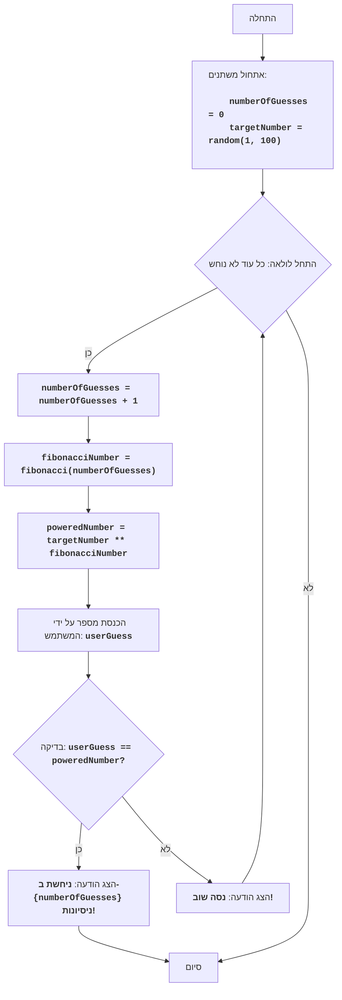

FIPOWR:
=================
קושי: 6
-----------------
המשחק "פיבונאצ'י בחזקה" - זהו משחק מתמטי, שבו המחשב בוחר מספר אקראי בטווח של 1 עד 100, והשחקן מזין מספר.
המחשב מעלה את המספר שנבחר באקראי בחזקת מספר פיבונאצ'י, התואם למספר הניסיון, ומשווה אותו למספר המשתמש.
המשחק נמשך עד שהמספרים שווים.
כללי המשחק:
1. המחשב בוחר מספר שלם אקראי מ-1 עד 100.
2. השחקן מזין את מספרו.
3. המחשב מחשב את מספר פיבונאצ'י, התואם למספר הניסיון, ומעלה את המספר האקראי בחזקה זו.
4. משווה את התוצאה שהתקבלה למספר השחקן.
5. המשחק נמשך עד שהמספרים שווים.
-----------------
אלגוריתם:
1. הגדר את מונה הניסיונות ל-0.
2. צור מספר אקראי בטווח של 1 עד 100.
3. התחל לולאה "כל עוד מספר השחקן אינו שווה למספר שהועלה בחזקת פיבונאצ'י":
    3.1. הגדל את מונה הניסיונות ב-1.
    3.2. חשב את מספר פיבונאצ'י, התואם למספר הניסיון.
    3.3. העלה את המספר האקראי בחזקת מספר פיבונאצ'י.
    3.4. בקש מהשחקן להזין מספר.
    3.5. אם מספר השחקן שווה למספר המחושב, עבור לשלב 4.
    3.6. אם מספר השחקן אינו שווה למספר המחושב, הצג הודעה על המצב הנוכחי.
4. הצג הודעה "ניחשת ב- {מספר ניסיונות} ניסיונות!"
5. סיום המשחק.
-----------------
תרשים זרימה:

מקרא:
    Start - התחלת התוכנית.
    InitializeVariables - אתחול משתנים: numberOfGuesses (מונה ניסיונות) מוגדר ל-0, ו-targetNumber (מספר נסתר) נוצר באופן אקראי מ-1 עד 100.
    LoopStart - התחלת הלולאה, הנמשכת עד שהמספר נוחש.
    IncreaseGuesses - הגדלת מונה הניסיונות ב-1.
    CalculateFibonacci - חישוב מספר פיבונאצ'י התואם לניסיון הנוכחי.
    CalculatePower - העלאת המספר הנסתר בחזקת מספר פיבונאצ'י.
    InputGuess - בקשת המשתמש להזין מספר ושמירתו במשתנה userGuess.
    CheckGuess - בדיקה האם המספר שהוזן userGuess שווה למספר המחושב poweredNumber.
    OutputWin - הצגת הודעת ניצחון אם המספרים שווים, עם ציון מספר הניסיונות.
    End - סיום התוכנית.
    OutputTryAgain - הצגת הודעה "נסה שוב!" אם המספר שהוזן אינו שווה למספר המחושב.

import random

# פונקציה לחישוב מספר פיבונאצ'י
def fibonacci(n):
    if n <= 0:
        return 0
    elif n == 1:
        return 1
    else:
        a, b = 0, 1
        for _ in range(2, n + 1):
            a, b = b, a + b
        return b

# אתחול מונה ניסיונות
numberOfGuesses = 0
# יצירת מספר אקראי מ-1 עד 100
targetNumber = random.randint(1, 100)

# לולאת המשחק הראשית
while True:
    # הגדלת מונה ניסיונות
    numberOfGuesses += 1
    # חישוב מספר פיבונאצ'י עבור הניסיון הנוכחי
    fibonacciNumber = fibonacci(numberOfGuesses)
    # העלאת המספר הנסתר בחזקת מספר פיבונאצ'י
    poweredNumber = targetNumber ** fibonacciNumber

    # בקשת קלט מספר מהמשתמש
    try:
        userGuess = int(input(f"ניסיון {numberOfGuesses}: הכנס מספר: "))
    except ValueError:
         print("אנא הכנס מספר שלם.")
         continue

    # בדיקה האם המספר נוחש
    if userGuess == poweredNumber:
        print(f"מזל טוב! ניחשת את המספר ב- {numberOfGuesses} ניסיונות!")
        break  # סיום הלולאה אם המספר נוחש
    else:
         print("נסה שוב!") # הצגת הודעה לנסות שוב

הסבר קוד:
1.  **ייבוא מודול `random`**:
   -  `import random`: מייבא את מודול `random`, המשמש ליצירת מספר אקראי.
2.  **פונקציה `fibonacci(n)`**:
    -   מגדירה את הפונקציה `fibonacci(n)`, המחשבת את המספר ה-n בסדרת פיבונאצ'י.
    -   משתמשת בגישה איטרטיבית לחישוב מספרי פיבונאצ'י.
3.  **אתחול משתנים**:
    -   `numberOfGuesses = 0`: מאתחל את המשתנה `numberOfGuesses` לספירת ניסיונות השחקן.
    -   `targetNumber = random.randint(1, 100)`: יוצר מספר שלם אקראי בטווח של 1 עד 100 ושומר אותו ב-`targetNumber`.
4. **לולאה ראשית `while True:`**:
    - לולאה אינסופית הנמשכת עד שהשחקן מנחש את המספר (פקודת `break` תבוצע).
    - `numberOfGuesses += 1`: מגדיל את מונה הניסיונות ב-1 בכל איטרציה חדשה של הלולאה.
    - `fibonacciNumber = fibonacci(numberOfGuesses)`: קורא לפונקציה `fibonacci` כדי לקבל את מספר פיבונאצ'י התואם לניסיון הנוכחי.
    - `poweredNumber = targetNumber ** fibonacciNumber`: מחשב את המספר הנסתר בחזקת מספר פיבונאצ'י.
    - **קלט**:
       - `try...except ValueError`: בלוק try-except מטפל בשגיאות קלט אפשריות. אם המשתמש יזין קלט שאינו מספר שלם, תוצג הודעת שגיאה.
       - `userGuess = int(input(f"ניסיון {numberOfGuesses}: הכנס מספר: "))`: מבקש מהמשתמש מספר וממיר אותו למספר שלם, שומר את התוצאה ב-`userGuess`.
    - **תנאי ניצחון**:
      -  `if userGuess == poweredNumber:`: בודק אם המספר שהוזן שווה לערך המחושב.
      -  `print(f"מזל טוב! ניחשת את המספר ב- {numberOfGuesses} ניסיונות!")`: מציג הודעת ניצחון ומספר ניסיונות.
      - `break`: מסיים את הלולאה (ואת המשחק) אם המספר נוחש.
    -  **רמז**:
       - `else:`: אם המספר לא נוחש, מוצגת ההודעה "נסה שוב!".
