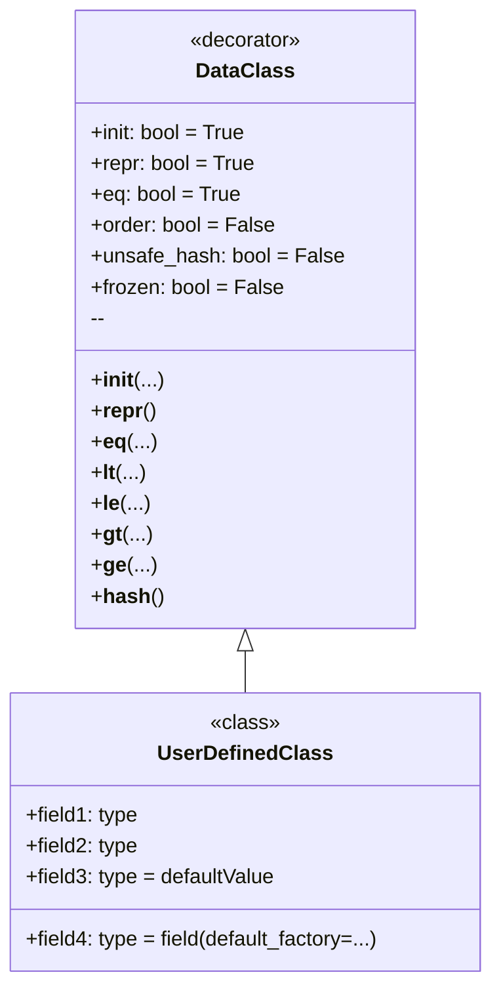

**מה זה `dataclass`?**

`dataclass` — זהו דקורטור, שהוצג בפייתון 3.7, המייצר אוטומטית שיטות מיוחדות (כגון `__init__`, `__repr__`, `__eq__` ואחרות) עבור מחלקות המשמשות בעיקר כקונטיינרים לנתונים. זה חוסך ממך את הצורך לכתוב הרבה קוד תבניתי.

**למה להשתמש ב-`dataclass`?**

1.  **קיצור קוד:** במקום להגדיר ידנית שיטות `__init__`, `__repr__`, `__eq__` וכו', אתה פשוט מצהיר על שדות הנתונים, ו-`dataclass` יעשה את כל השאר.
2.  **שיפור קריאות:** מחלקות הופכות לתמציתיות ומובנות יותר, מכיוון שהן מתמקדות בנתונים ולא ביישום הטכני.
3.  **הפחתת שגיאות:** קוד שנוצר אוטומטית אמין יותר בדרך כלל מקוד שנכתב ידנית.
4.  **האצת פיתוח:** תוכל ליצור מחלקות לעבודה עם נתונים מהר יותר, מבלי לבזבז זמן על שגרה.

**כיצד להשתמש ב-`dataclass`?**

ראשית, עליך לייבא את הדקורטור `dataclass` מהמודול `dataclasses`:

```python
from dataclasses import dataclass
```

לאחר מכן, אתה מסמן את המחלקה בדקורטור `@dataclass`, ומגדיר את שדות הנתונים כמשתני מחלקה רגילים עם הערות סוג:

```python
from dataclasses import dataclass

@dataclass
class Point:
    x: int
    y: int
```

בדוגמה זו, `Point` — זוהי `dataclass`, שיש לה שני שדות: `x` ו-`y`, שניהם מסוג שלם. `dataclass` תיצור אוטומטית:
    * בנאי `__init__`, המאפשר ליצור מופעים של המחלקה, לדוגמה `Point(1, 2)`.
    *  `__repr__`, המחזיר ייצוג מחרוזתי של האובייקט, לדוגמה `Point(x=1, y=2)`.
    * `__eq__`, המאפשר להשוות אובייקטים, לדוגמה `Point(1, 2) == Point(1, 2)`.

**דוגמה לשימוש פשוט**
```python
from dataclasses import dataclass

@dataclass
class Point:
    x: int
    y: int

# יצירת מופע של המחלקה
point1 = Point(1, 2)
point2 = Point(1, 2)
point3 = Point(3, 4)

# פלט
print(point1) # יוציא: Point(x=1, y=2)
print(point1 == point2) # יוציא: True
print(point1 == point3) # יוציא: False
```

**אפשרויות `dataclass`**

`dataclass` מספקת מספר פרמטרים להתאמה אישית של ההתנהגות:

*   `init`: אם `True` (ברירת מחדל), נוצרת שיטת `__init__`. אם `False`, שיטת `__init__` לא נוצרת.
*   `repr`: אם `True` (ברירת מחדל), נוצרת שיטת `__repr__`. אם `False`, שיטת `__repr__` לא נוצרת.
*   `eq`: אם `True` (ברירת מחדל), נוצרת שיטת `__eq__`. אם `False`, שיטת `__eq__` לא נוצרת.
*   `order`: אם `True`, נוצרות שיטות השוואה (`__lt__`, `__le__`, `__gt__`, `__ge__`). ברירת המחדל היא `False`.
*   `unsafe_hash`: אם `False` (ברירת מחדל), שיטת `__hash__` לא נוצרת. אם `True`, שיטת `__hash__` תיווצר, ו-`dataclass` תהפוך לניתנת לגיבוב (hashable).
*   `frozen`: אם `True`, מופעי המחלקה יהיו בלתי ניתנים לשינוי (לקריאה בלבד). ברירת המחדל היא `False`.

**דוגמאות לשימוש בפרמטרים**
1. השבתת שיטת `__repr__` והפיכת המחלקה לבלתי ניתנת לשינוי
```python
from dataclasses import dataclass

@dataclass(repr=False, frozen=True)
class Point:
    x: int
    y: int

# יצירת מופע של המחלקה
point1 = Point(1, 2)
# פלט
print(point1) # יוציא: <__main__.Point object at 0x000001D8322F6770> (מכיוון ש-__repr__ לא מוגדר)

# שינוי מופע יגרום לשגיאה
try:
    point1.x = 10
except Exception as e:
    print (e) # יוציא: cannot assign to field 'x'
```
2. הגדרת סדר, הוספת שיטת hash והפיכת המחלקה לבלתי ניתנת לשינוי
```python
from dataclasses import dataclass

@dataclass(order=True, unsafe_hash=True, frozen=True)
class Point:
    x: int
    y: int

# יצירת מופע של המחלקה
point1 = Point(1, 2)
point2 = Point(3, 4)
point3 = Point(1, 2)
# פלט
print(point1 < point2) # יוציא: True
print(point1 == point3) # יוציא: True

# כעת ניתן להשתמש במחלקה כמפתח מילון
my_dict = {point1: "first", point2: "second"}
print(my_dict) # יוציא: {Point(x=1, y=2): 'first', Point(x=3, y=4): 'second'}
```

**ערכי ברירת מחדל**

תוכל להגדיר ערכי ברירת מחדל לשדות:

```python
from dataclasses import dataclass

@dataclass
class Point:
    x: int = 0
    y: int = 0

# יצירת מופע של המחלקה
point1 = Point()
point2 = Point(1, 2)

# פלט
print(point1) # יוציא: Point(x=0, y=0)
print(point2) # יוציא: Point(x=1, y=2)
```
בעת יצירת מופע של המחלקה, אם לא הועברו ערכים, ייעשה שימוש בערך ברירת המחדל.

**שימוש ב-`dataclass` עם טיפוסים ניתנים לשינוי**

היזהר בעת שימוש בטיפוסי נתונים ניתנים לשינוי (רשימות, מילונים) כערכי ברירת מחדל. הם ייווצרו רק פעם אחת וישמשו את כל מופעי המחלקה:

```python
from dataclasses import dataclass
from typing import List

@dataclass
class BadExample:
    items: List[int] = []

bad1 = BadExample()
bad2 = BadExample()

bad1.items.append(1)
print (bad1.items) # יוציא: [1]
print (bad2.items) # יוציא: [1] 
```
בדוגמה לעיל, שינויים ב-`bad1.items` משתקפים גם ב-`bad2.items`. זה קורה מכיוון ששני מופעי המחלקה משתמשים באותה רשימת ברירת מחדל.

כדי למנוע זאת, השתמש ב-`dataclasses.field` וב-`default_factory`:
```python
from dataclasses import dataclass, field
from typing import List

@dataclass
class GoodExample:
    items: List[int] = field(default_factory=list)

good1 = GoodExample()
good2 = GoodExample()

good1.items.append(1)
print (good1.items) # יוציא: [1]
print (good2.items) # יוציא: []
```
במקרה זה, `default_factory=list` תיצור רשימה ריקה חדשה עבור כל מופע חדש של המחלקה.

**דיאגרמה**

הנה דיאגרמה המציגה את המושגים העיקריים של `dataclass`:



בדיאגרמה זו:
*   `DataClass` מייצגת את הדקורטור `@dataclass` ואת הפרמטרים שלו.
*   `UserDefinedClass` — זוהי המחלקה שאתה מצהיר עליה באמצעות הדקורטור `@dataclass`.
*   החץ מ-`DataClass` ל-`UserDefinedClass` מראה ש-`DataClass` מיושמת על `UserDefinedClass`.


## `dict()`, `__dir__()` ותכונות נוספות של `dataclass`.

*   `dict()` לא עובד ישירות עם מופעי `dataclass`. כדי להמיר למילון, עליך להשתמש בשיטות ידניות או בספריות צד שלישי.
*   `__dir__()` מחזיר רשימה של כל התכונות והשיטות של האובייקט, כולל שיטות ושדות שנוצרו על ידי `dataclass`.
*   `__dataclass_fields__` ו-`__dataclass_params__` מספקים מטא-נתונים על שדות ופרמטרים של `dataclass`.

**1. `dict()` בהקשר של `dataclass`**

   - **אין תמיכה אוטומטית:** הפונקציה המובנית `dict()` לא עובדת ישירות עם מופעי `dataclass`, כמו עם מילונים רגילים. אם תנסה לקרוא ל-`dict(instance_of_dataclass)`, תקבל שגיאה `TypeError: cannot convert dictionary update sequence element #0 to a sequence`.
   
   - **המרת למילון:** כדי להמיר מופע `dataclass` למילון, עליך לעשות זאת ידנית או להשתמש בספריית צד שלישי. הנה איך ניתן לעשות זאת ידנית:

     ```python
     from dataclasses import dataclass
     
     @dataclass
     class Person:
         name: str
         age: int
     
     person = Person("Alice", 30)
     
     # המרה ידנית למילון
     person_dict = {field.name: getattr(person, field.name) for field in dataclasses.fields(Person)}
     print(person_dict)  # יוציא: {'name': 'Alice', 'age': 30}

     #אפשרות חלופית:
     person_dict = person.__dict__
     print(person_dict) #יוציא: {'name': 'Alice', 'age': 30}
     ```
   - **למה כך?** `dataclass` מיועדת בעיקר לייצג נתונים בצורת מחלקות. למרות שהנתונים נשמרים כתכונות אובייקט, `dataclass` לא הופכת אותם לנגישים אוטומטית כמילון.

**2. `__dir__()` ב-`dataclass`**

   - **מחזיר תכונות:** השיטה `__dir__()` מחזירה רשימה של מחרוזות המייצגות את שמות התכונות והשיטות של האובייקט. עבור `dataclass`, `__dir__()` יכלול:
     - את כל שדות הנתונים המוגדרים.
     - שיטות שנוצרו אוטומטית (`__init__`, `__repr__`, `__eq__`, וכו', בהתאם להגדרות).
     - כל שיטות אחרות שנוספו ידנית.

   - **דוגמה:**
      ```python
      from dataclasses import dataclass
      
      @dataclass
      class Point:
          x: int
          y: int
          
          def distance(self):
                return (self.x**2 + self.y**2)**0.5
      
      point = Point(1, 2)
      print(dir(point))
      #יוציא:
      #['__class__', '__dataclass_fields__', '__dataclass_params__', '__delattr__', '__dict__', '__dir__', '__doc__', '__eq__', '__format__', '__ge__', '__getattribute__', '__gt__', '__hash__', '__init__', '__init_subclass__', '__le__', '__lt__', '__module__', '__ne__', '__new__', '__reduce__', '__reduce_ex__', '__repr__', '__setattr__', '__sizeof__', '__str__', '__subclasshook__', '__weakref__', 'distance', 'x', 'y']

      ```

   - **שימושיות:** `__dir__()` יכול להיות שימושי לאינטרוספקציה - צפייה בתכונות ובשיטות הזמינות של מופע `dataclass`.
   
**3. תכונות נוספות של `dataclass`**

   - **`__dataclass_fields__`:**
      - זוהי תכונת מחלקה המכילה מילון, שבו המפתחות הם שמות שדות `dataclass`, והערכים הם אובייקטים `dataclasses.Field`.
      - תכונה זו מאפשרת לקבל מטא-נתונים על שדות `dataclass` (לדוגמה, סוג, ערך ברירת מחדל, וכו').

     ```python
     from dataclasses import dataclass, fields
     
     @dataclass
     class Point:
          x: int = 0
          y: int = 0
     
     print(Point.__dataclass_fields__)
     #יוציא:
     #{'x': Field(name='x',type=<class 'int'>,default=0,default_factory=MISSING,init=True,repr=True,hash=None,compare=True,metadata=mappingproxy({}),kw_only=False), 'y': Field(name='y',type=<class 'int'>,default=0,default_factory=MISSING,init=True,repr=True,hash=None,compare=True,metadata=mappingproxy({}),kw_only=False)}
     ```
     ```python
     # נשתמש ב-fields() לאותה תוצאה
     for field in fields(Point):
         print(field.name, field.type, field.default)
     #יוציא:
     #x <class 'int'> 0
     #y <class 'int'> 0
     ```
  
   - **`__dataclass_params__`:**
      - זוהי תכונת מחלקה המאחסנת מידע על פרמטרים של `dataclass` (לדוגמה, `init`, `repr`, `eq`, `order`, וכו').
      - זה מאפשר גישה להגדרות שבהן נוצרה ה-`dataclass`.

      ```python
      from dataclasses import dataclass
      
      @dataclass(order = True, frozen = True)
      class Point:
        x: int
        y: int
      print(Point.__dataclass_params__)
      #יוציא:
      #dataclass_params(init=True,repr=True,eq=True,order=True,unsafe_hash=False,frozen=True)
      ```

   - **שימוש עם ירושה:** תוכל ליצור `dataclass` על ידי ירושה מ-`dataclass` אחרות.
   - **שימוש עם `typing.NamedTuple`:** `dataclass` היא חלופה גמישה יותר ל-`typing.NamedTuple`, מכיוון שהיא מאפשרת להגדיר ערכי ברירת מחדל, להוסיף שיטות משלך, וכן להפוך את המחלקה לניתנת לשינוי או לבלתי ניתנת לשינוי.
