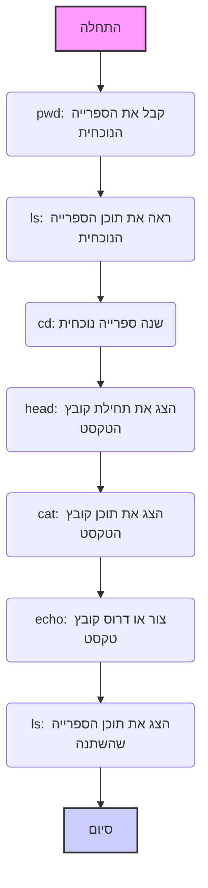

מה זה Google Colab?

Google Colab היא פלטפורמה מבוססת ענן, שנוצרה על ידי גוגל, לעבודה עם מחברות Jupyter אינטראקטיביות.
היא מספקת כלים רבי עוצמה לכתיבה והרצת קוד Python, ניתוח נתונים, אימון מודלים של למידת מכונה ושיתוף פעולה בפרויקטים.

Colab מספקת גישה למשאבי מחשוב חזקים, כולל יחידות עיבוד גרפיות (GPU) ויחידות עיבוד טנסוריות (TPU).
זה מאפשר לך לפתור בעיות מורכבות, כגון עיבוד נתונים גדולים או אימון רשתות עצביות, ללא צורך ברכישת חומרה יקרה. Colab בנויה על בסיס Jupyter Notebook, ומספקת ממשק נוח לעבודה עם קוד, טקסט והדמיות. תוכל להריץ תאי קוד, להוסיף טקסט הסבר, ליצור גרפים והדמיות ישירות בדפדפן שלך. ניתן להשתמש ב-Colab מיד לאחר פתיחתו. אין צורך להתקין תוכניות, ספריות או דרייברים נוספים. הכל כבר מוגדר לעבודה. תוכל לחבר את Google Drive שלך, מה שמאפשר לך להעלות נתונים בקלות, לשמור פרויקטים ולהבטיח גישה לקבצים מכל מקום. Colab תומכת בעבודה שיתופית. תוכל לשתף את הפרויקטים שלך עם עמיתים, לערוך מחברות בו זמנית ולדון בשינויים בזמן אמת.


### איך עובד Google Colab?
- אתה מריץ מחברת Jupyter בדפדפן שלך, מה שמבטל את הצורך בהתקנת סביבה מקומית.
- הקוד מבוצע בשרתים מרוחקים של גוגל, והתוצאות מוצגות במחברת שלך.
- נתונים יכולים להיטען ממכשיר מקומי או מהענן, כגון Google Drive.
- אתה יכול להשתמש ב-Colab לכתיבת קוד Python, עבודה עם ספריות למידת מכונה (לדוגמה, TensorFlow, PyTorch), ניתוח נתונים באמצעות Pandas, או יצירת הדמיות באמצעות Matplotlib ו-Seaborn.


איך נראה Google Colab?


הממשק של Colab מורכב מכמה חלקים עיקריים:

תאי קוד: אלו הם התאים שבהם תכתוב ותריץ את קוד ה-Python שלך.

תאי טקסט: כאן תוכל להוסיף תיאורים, הסברים והערות לקוד שלך.

תפריט: למעלה יש תפריט עם אפשרויות שונות לעבודה עם המחברת (קובץ, עריכה, תצוגה, כלים וכו').

מנהל קבצים: משמאל יש פאנל של מנהל הקבצים שבו תוכל להציג קבצים ותיקיות בסביבת Colab שלך.


ב-Google Colab, אתה עובד בסביבת ענן,
שבה מערכת הקבצים מאורגנת כמו במחשב רגיל עם תיקיות וקבצים.
Colab מספקת כלים לניווט, יצירה, צפייה ועריכה של קבצים.
תוכל לתקשר עם מערכת הקבצים באמצעות **פקודות קסם של Jupyter** (המתחילות ב-`%`)
ו**פקודות bash** (המתחילות ב-`!`).

**רשימת פקודות בסיסיות:**

1.  **`%pwd`** (print working directory):
    *   **תיאור**: מציג את ספריית העבודה הנוכחית (היכן אתה נמצא כרגע במערכת הקבצים).
    *   **דוגמה**: `%pwd`
    *   **תוצאה**: `/content` (או ספרייה נוכחית אחרת)

2.  **`%ls`** (list):
    *   **תיאור**: מציג קבצים ותיקיות בספרייה הנוכחית.
    *   **דוגמה**: `%ls`
    *   **תוצאה**: רשימת קבצים ותיקיות, לדוגמה: `sample_data/  my_file.txt`

3.  **`%cd <נתיב>`** (change directory):
    *   **תיאור**: עובר לספרייה שצוינה.
    *   **דוגמה**: `%cd sample_data`
    *   **תוצאה**: ספריית העבודה הנוכחית משתנה ל-`/content/sample_data`

4.  **`!head -<מספר שורות> <שם קובץ>`**:
    *   **תיאור**: מציג את השורות הראשונות של קובץ הטקסט שצוין.
    *   **דוגמה**: `!head -5 README.md`
    *   **תוצאה**: 5 השורות הראשונות של הקובץ `README.md`.

5.  **`!cat <שם קובץ>`**:
    *   **תיאור**: מציג את תוכן קובץ הטקסט שצוין.
    *   **דוגמה**: `!cat sample_file.txt`
    *   **תוצאה**: כל תוכן הקובץ `sample_file.txt`.

6.   **`!echo "<טקסט>" > <שם קובץ>`**
    *   **תיאור:** יוצר קובץ חדש עם השם שצוין וכותב בו טקסט. אם הקובץ כבר קיים, הוא יידרס.
    *   **דוגמה:** `!echo "זה הקובץ החדש שלי!" > new_file.txt`
    *   **תוצאה:** יוצר את הקובץ `new_file.txt` עם התוכן `זה הקובץ החדש שלי!`.

**נקודות מפתח:**

*   **פקודות קסם** (`%`) - אלו הן פקודות Jupyter מיוחדות לעבודה עם סביבת Colab.
*   **פקודות bash** (`!`) - אלו הן פקודות המבוצעות בשורת הפקודה של לינוקס.
*   **נתיב קובץ**: נתיב הקובץ מציין היכן בדיוק הקובץ ממוקם במערכת הקבצים (לדוגמה, `/content/sample_data/my_file.txt`).
*   **ספרייה נוכחית**: המיקום שלך במערכת הקבצים (משתנה באמצעות הפקודה `%cd`).

**דיאגרמה הממחישה את רצף הפקודות:**



**העלאת קבצים ל-Google Colab**

ישנן מספר דרכים להעלות קבצים ל-Colab, ואנו נבחן את הנפוצות שבהן.

1.  **העלאה באמצעות מנהל הקבצים (GUI)**
    *   **תיאור:** הדרך הקלה ביותר להעלות קבצים, במיוחד קטנים, היא להשתמש בממשק הגרפי של מנהל הקבצים של Colab.
    *   **כיצד לעשות זאת:**
        1.  פתח את פאנל מנהל הקבצים משמאל (סמל תיקייה).
        2.  לחץ על סמל ההעלאה (בדרך כלל זה סימן פלוס או חץ למעלה).
        3.  בחלון שנפתח, בחר את הקבצים במחשב שלך שברצונך להעלות.
        4.  לחץ על "פתח" או "העלה".
    *   **יתרונות:** פשטות, בהירות, אינו דורש כתיבת קוד.
    *   **חסרונות:** מתאים לקבצים קטנים, יש לבצע ידנית.
   


2.  **העלאה באמצעות קוד Python (`google.colab.files.upload()`)**
    *   **תיאור**: שיטה זו מאפשרת לך להעלות קבצים באמצעות קוד Python, מה שמעניק גמישות רבה יותר.
    *   **כיצד לעשות זאת:**
        1.  ייבא את המודול `files` מהספרייה `google.colab`.
           ```python
           from google.colab import files
           ```
        2.  קרא לפונקציה `files.upload()`.
             ```python
             uploaded = files.upload()
             ```
        3.  כאשר תריץ קוד זה, יופיע חלון דיאלוג שבו תוכל לבחור קבצים להעלאה.
    *   **יתרונות:** ניתן להשתמש בקוד, מאפשר עיבוד תוכנתי של קבצים שהועלו.
    *   **חסרונות:** דורש כתיבת קוד, פחות אינטואיטיבי ממנהל הקבצים.

    לאחר ביצוע קוד זה, הקבצים שהועלו יהיו זמינים כמילון `uploaded`, כאשר המפתחות הם שמות הקבצים והערכים הם תוכנם כמחרוזות בתים.
    ```python
    # דוגמה לשימוש בקבצים שהועלו
    for file_name, file_data in uploaded.items():
       print(f"קובץ: {file_name}")
       # עיבוד נתוני קובץ
       # לדוגמה:
       # import pandas as pd
       # df = pd.read_csv(io.BytesIO(file_data))
       # print(df.head())
    ```
    


3.  **שכפול מאגר GitHub (`git clone`)**
    *   **תיאור**: אם הקבצים שלך נמצאים במאגר GitHub, תוכל להוריד אותם על ידי שכפול המאגר ל-Colab.
    *   **כיצד לעשות זאת:**
        1.  השתמש בפקודה `git clone` עם כתובת ה-URL של המאגר.
            ```python
            !git clone <URL_מאגר>
            ```
            לדוגמה:
           ```python
           !git clone https://github.com/username/my_repository.git
           ```
        2. לאחר שכפול המאגר, התוכן יהיה זמין בתיקייה בעלת אותו שם כמו המאגר.
    *   **יתרונות:** קל להוריד את כל הקבצים מהמאגר, דרך נוחה לפרויקטים עם בקרת גרסאות.
    *   **חסרונות:** מתאים רק לקבצים במאגרי GitHub.

    
   ```html
<div align="center">
  
  <p><em>שכפול מאגר GitHub ב-Colab</em></p>
</div>
```

4.  **הורדת קובץ בודד מ-GitHub**
     *   **תיאור**: אם אתה צריך רק קובץ אחד או כמה קבצים ממאגר GitHub, תוכל להוריד אותם באמצעות קישור ישיר.
     *   **כיצד לעשות זאת:**
         1.  פתח את הקובץ הרצוי במאגר GitHub.
         2.  לחץ על כפתור "View raw" (או "תצוגה גולמית").
         3.  העתק את כתובת ה-URL של קובץ זה.
        4.  השתמש ב-`wget` או ב-`curl` כדי להוריד את הקובץ.
            ```python
            !wget <URL_קובץ>
            ```
           או
             ```python
            !curl <URL_קובץ> -o <שם_קובץ_ב-colab>
             ```
    *   **יתרונות**: קל להוריד רק את הקבצים הנחוצים, ללא שכפול כל המאגר.
    *   **חסרונות**: דורש ידיעת הקישור הישיר לקובץ.


**איזו שיטה לבחור?**

*   לקבצים קטנים שצריך להעלות במהירות ובאופן ידני, **מנהל הקבצים** מתאים.
*   אם אתה צריך לעבד קבצים שהועלו באופן תוכנתי, השתמש ב-**`files.upload()`**.
*   להעלאת פרויקטים שלמים, השתמש ב-**`git clone`**.
*  להורדת קבצים בודדים, השתמש ב-**`wget` או ב-`curl`**
