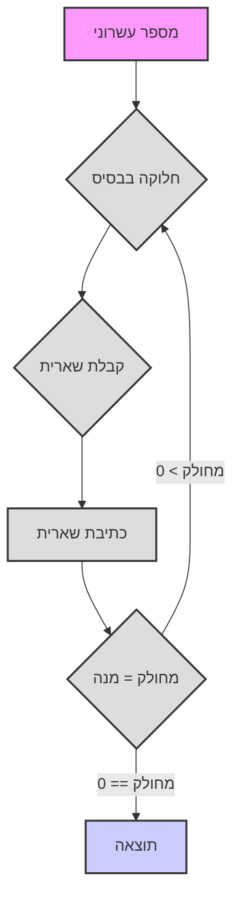

# מערכות ספירה

שלום! בואו נצלול לעולם המרתק של מערכות הספירה. תתכוננו, היום תלמדו הרבה דברים חדשים ומעניינים!

# מערכות ספירה

**1. מערכת ספירה מופשטת**

תארו לעצמכם שמספרים הם כמו מילים שניתן לכתוב ב"אותיות" שונות. לא משנה בדיוק איך אנו מציינים מספרים, העיקר שישמרו כללים מסוימים:

*   **בסיס:** זהו מספר הסמלים הייחודיים (ספרות) שאנו משתמשים בהם. נסמן את הבסיס כ-`b`. לדוגמה, במערכת העשרונית הבסיס הוא 10.
*   **ספרות:** אלו הם הסמלים שאנו משתמשים בהם לכתיבת מספרים. בדרך כלל אלו ספרות ערביות (0, 1, 2, 3, ...), אך יכולים להיות גם סמלים אחרים, לדוגמה, אותיות לטיניות (I, V, X) או אפילו פירות (🍎, 🍐, 🍉).
*   **מיקום:** לכל ספרה בייצוג מספר יש מיקום משלה, המשפיע על ערכה. זה אומר שאותה ספרה יכולה להיות בעלת ערך שונה בהתאם למיקומה במספר.
*   **ערכי מיקום:** כל מיקום נקרא ערך מיקום (לדוגמה, יחידות, עשרות, מאות וכו'). בכל מיקום, ערך הספרה מוכפל בבסיס בחזקה המתאימה למספר ערך המיקום.

**כיצד נבנית מערכת ספירה?**

1.  **בחירת בסיס:** אנו בוחרים מספר שלם `b` שיהיה בסיס המערכת שלנו.
2.  **בחירת ספרות:** אנו זקוקים ל-`b` ספרות ייחודיות. בדרך כלל אלו 0, 1, 2, ..., `b-1`. לדוגמה, עבור המערכת הבינארית (בסיס 2) יש לנו את הספרות 0 ו-1.
3.  **כתיבת מספר:** מספר נכתב כרצף של ספרות. ערך כל ספרה מוכפל בבסיס בחזקה השווה למיקומה (החל מ-0 מימין).

**נוסחה לחישוב ערך מספר:**

אם יש לנו מספר הכתוב כרצף ספרות `dₙ dₙ₋₁ ... d₁ d₀`, ניתן לחשב את ערכו במערכת העשרונית באמצעות הנוסחה:

`ערך = dₙ * bⁿ + dₙ₋₁ * bⁿ⁻¹ + ... + d₁ * b¹ + d₀ * b⁰`

כאשר:

*   `dᵢ` - ספרה במיקום ה-i
*   `b` - בסיס מערכת הספירה
*   `i` - מספר המיקום (מימין לשמאל, החל מ-0)

**דוגמה:**

נניח שיש לנו את המספר 123 במערכת העשרונית (בסיס 10). לפי הנוסחה:

`1 * 10² + 2 * 10¹ + 3 * 10⁰ = 100 + 20 + 3 = 123₁₀`

**סדרי ספירה (מיקומים):**

סדרי ספירה, כפי שכבר אמרנו, הם מיקומי הספרות במספר, לכל מיקום יש משקל משלו, הנקבע על ידי הבסיס בחזקת מספרו הסידורי.
*   `d₀`: יחידות (`b⁰`)
*   `d₁`: `b` (`b¹`)
*   `d₂`: `b²`
*   `d₃`: `b³`
*   וכן הלאה

**כללים:**

1.  **טווח ספרות:** משתמשים בספרות מ-0 עד `b-1`.
2.  **עיקרון מיקום:** ערך הספרה תלוי במיקומה.
3.  **מעבר למיקום הבא:** כאשר במיקום מגיעים לערך `b`, מתבצעת העברה למיקום הבא (אנלוגי לאופן שבו לאחר 9 במערכת העשרונית מתווסף 1 למיקום הבא ומתקבל 10).

## דוגמה: מערכת ספירה פירותית

בואו נבחן דוגמה של מערכת ספירה מופשטת עם פירות:

*   🍎 (תפוח)
*   🍐 (אגס)
*   🍉 (אבטיח)
*   🧺 (סלסלה)

**כללים:**

1.  3 🍎 = 1 🍐
2.  5 🍐 = 3 🍉
3.  2 🍉 = 1 🧺

**ייצוג מספרים:**

אנו נייצג את כמות הפירות כמחרוזת, כאשר כל תו יוניקוד מתאים לפרי אחד. לדוגמה, "🍎🍎🍎" - 3 תפוחים, ו-"🍉🍉" - 2 אבטיחים.

**פעולות חשבון:**

אנו יכולים לבצע פעולות חיבור וחיסור. ראשית, נבצע חיבור.

**קוד Python:**

```python
def normalize_fruits(fruits: str) -> str:
    """
    מנרמל מחרוזת פירות, מביא אותה לייצוג מינימלי,
    באמצעות כללי החלפת פירות.

    Args:
        fruits: מחרוזת פירות (🍎, 🍐, 🍉, 🧺).

    Returns:
        מחרוזת עם כמות פירות מנורמלת.
    """
    apples = fruits.count('🍎')
    pears = fruits.count('🍐')
    melons = fruits.count('🍉')
    baskets = fruits.count('🧺')

    # המרת תפוחים לאגסים
    pears += apples // 3
    apples %= 3

    # המרת אגסים לאבטיחים
    melons += (pears * 3) // 5
    pears %= 5

    # המרת אבטיחים לסלסלות
    baskets += melons // 2
    melons %= 2

    # הרכבת המחרוזת בחזרה, תחילה סלסלות, אחר כך אבטיחים, אגסים, תפוחים
    return (
        "🧺" * baskets
        + "🍉" * melons
        + "🍐" * pears
        + "🍎" * apples
    )


def add_fruits(fruits1: str, fruits2: str) -> str:
    """
    מחבר שתי מחרוזות פירות.

    Args:
        fruits1: מחרוזת פירות.
        fruits2: מחרוזת פירות.

    Returns:
        מחרוזת עם סכום הפירות.
    """
    return normalize_fruits(fruits1 + fruits2)


def sub_fruits(fruits1: str, fruits2: str) -> str:
    """
    מחסר את מחרוזת הפירות השנייה מהראשונה, אם אפשר.

    Args:
        fruits1: מחרוזת פירות שממנה מחסרים.
        fruits2: מחרוזת פירות שמחסרים.

    Returns:
        מחרוזת עם הפרש הפירות או "לא ניתן לחסר" אם התוצאה שלילית.
    """

    apples1 = fruits1.count('🍎')
    pears1 = fruits1.count('🍐')
    melons1 = fruits1.count('🍉')
    baskets1 = fruits1.count('🧺')

    apples2 = fruits2.count('🍎')
    pears2 = fruits2.count('🍐')
    melons2 = fruits2.count('🍉')
    baskets2 = fruits2.count('🧺')


    # ייצוג זמני ככמות כוללת של תפוחים
    total_apples1 = apples1 + pears1 * 3 + melons1 * 15 // 3 + baskets1 * 30
    total_apples2 = apples2 + pears2 * 3 + melons2 * 15 // 3 + baskets2 * 30

    if total_apples1 < total_apples2:
        return "לא ניתן לחסר"
    else:
        total_apples = total_apples1 - total_apples2

    # החזרת ייצוג מנורמל של סכום התפוחים
    result_fruits = ""
    baskets = total_apples // 30
    result_fruits += "🧺" * baskets
    total_apples %= 30
    melons = (total_apples*3) // 15
    result_fruits += "🍉" * melons
    total_apples %= 15
    pears = total_apples // 3
    result_fruits += "🍐" * pears
    total_apples %= 3
    result_fruits += "🍎" * total_apples

    return normalize_fruits(result_fruits)


# דוגמאות:
fruits1 = "🍎🍎🍎🍎🍎" # 5 תפוחים
fruits2 = "🍎🍎🍎" # 3 תפוחים
print(f"{fruits1} + {fruits2} = {add_fruits(fruits1, fruits2)}")

fruits3 = "🍐🍐"  # 2 אגסים
fruits4 = "🍎🍎🍎🍎" # 4 תפוחים
print(f"{fruits3} + {fruits4} = {add_fruits(fruits3, fruits4)}")

fruits5 = "🍉🍉" # 2 אבטיחים
fruits6 = "🍎🍎🍎🍎🍎🍎🍎🍎🍎🍎🍎🍎🍎🍎🍎" # 15 תפוחים
print(f"{fruits5} + {fruits6} = {add_fruits(fruits5, fruits6)}")

fruits7 = "🧺🧺" # 2 סלסלות
fruits8 = "🍉🍉🍉" # 3 אבטיחים
print(f"{fruits7} + {fruits8} = {add_fruits(fruits7, fruits8)}")

fruits9 = "🧺🍉🍐🍎" # 1 סלסלה, 1 אבטיח, 1 אגס, 1 תפוח
fruits10 = "🍉🍐🍎" # 1 אבטיח, 1 אגס, 1 תפוח
print(f"{fruits9} - {fruits10} = {sub_fruits(fruits9, fruits10)}")

fruits11 = "🧺🍉" # 1 סלסלה, 1 אבטיח
fruits12 = "🧺🍉🍎🍎🍎" # 1 סלסלה, 1 אבטיח, 3 תפוחים
print(f"{fruits11} - {fruits12} = {sub_fruits(fruits11, fruits12)}")

fruits13 = "🍉🍉🍉" # 3 אבטיחים
fruits14 = "🍎🍎🍎🍎" # 4 תפוחים
print(f"{fruits13} - {fruits14} = {sub_fruits(fruits13, fruits14)}")

fruits15 = "🍐🍐🍐🍐🍐" # 5 אגסים
fruits16 = "🍉" # 1 אבטיח
print(f"{fruits15} - {fruits16} = {sub_fruits(fruits15, fruits16)}")
```

**הסבר קוד:**

1.  **`normalize_fruits(fruits)`:** פונקציה זו ממירה מחרוזת פירות לצורתה המינימלית. היא סופרת תחילה את כמות כל פרי, ולאחר מכן, באמצעות כללי ההחלפה, ממירה אותם ליחידות גדולות יותר (תפוחים לאגסים, אגסים לאבטיחים, אבטיחים לסלסלות), ולאחר ההמרה, מחברת אותם בחזרה למחרוזת עם סט הפירות המינימלי.
2.  **`add_fruits(fruits1, fruits2)`:** פונקציה זו מבצעת חיבור של שתי מחרוזות פירות. היא פשוט משרשרת את שתי המחרוזות ולאחר מכן מנרמלת את התוצאה.
3.  **`sub_fruits(fruits1, fruits2)`:** זוהי פונקציה לחיסור מחרוזת פירות אחת מהשנייה. היא ממירה הכל ל"כמות תפוחים" ולאחר מכן מבצעת את החיסור, ולאחר מכן ממירה את התפוחים בחזרה לצורה מנורמלת, תוך בדיקת אפשרות החיסור.
4.  **דוגמאות:** בסוף הקוד מובאות דוגמאות לחיבור וחיסור עם שילובי פירות שונים ופלט התוצאות.

**משימות:**

1.  נסה להוסיף לקוד פונקציה להכפלת פירות במספר שלם (לדוגמה, `multiply_fruits(fruits, n)`).
2.  יישם את הפונקציה `compare_fruits(fruits1, fruits2)`, המשווה שתי מחרוזות פירות ומחזירה "גדול יותר", "קטן יותר" או "שווה".
3.  המצא כללי החלפת פירות משלך ושנה את הקוד בהתאם.
4.  הוסף בדיקת תקינות נתוני קלט (כדי שהמחרוזת תכיל רק תווי יוניקוד מותרים).
5.  יישם חיסור מתקדם יותר, לדוגמה, אל תציג שגיאה "לא ניתן לחסר", אלא הצג את התוצאה עם סימן מינוס (משימה מורכבת).

## 2. מערכות ספירה ספציפיות

כעת נעבור לדוגמאות ספציפיות של מערכות ספירה המשמשות לעתים קרובות במדעי המחשב ובחיי היומיום.

### 2.1. מערכת בינארית (בסיס 2)

*   **ספרות:** 0, 1
*   **בשימוש במחשבים:** כל הנתונים במחשבים מיוצגים בקוד בינארי (ביטים).

**דוגמה:**

*   מספר `1011₂` (נקרא "אחד אפס אחד אחד בבסיס 2"). המרה למערכת עשרונית:
    `1 * 2³ + 0 * 2² + 1 * 2¹ + 1 * 2⁰ = 8 + 0 + 2 + 1 = 11₁₀`

**Python:**

```python
def bin_to_dec(binary: str) -> int:
    """
    ממיר מספר בינארי (מחרוזת) לעשרוני.

    Args:
        binary: מספר בינארי כמחרוזת.

    Returns:
        ייצוג עשרוני של המספר (מספר שלם).
    """
    decimal = 0  # אתחול ערך עשרוני
    power = 0  # אתחול חזקת שתיים (מעריך מיקום)
    for digit in reversed(binary):  # איטרציה על ספרות המספר הבינארי בסדר הפוך
        if digit == '1':
            decimal += 2 ** power  # אם הספרה היא '1', הוסף 2 בחזקת המיקום
        power += 1  # הגדל את החזקה עבור המיקום הבא
    return decimal  # החזר ערך עשרוני


binary_number = "1011"
decimal_number = bin_to_dec(binary_number)
print(f"בינארי {binary_number} = עשרוני {decimal_number}")


def dec_to_bin(decimal: int) -> str:
    """
    ממיר מספר עשרוני (שלם) לייצוג בינארי (מחרוזת).

    Args:
        decimal: מספר עשרוני.

    Returns:
        ייצוג בינארי של המספר (מחרוזת).
    """
    if decimal == 0:  # אם המספר העשרוני הוא 0
        return "0"  # החזר מחרוזת "0"
    binary = ""  # אתחול מחרוזת למספר בינארי
    while decimal > 0:  # כל עוד המספר העשרוני גדול מ-0
        binary = str(decimal % 2) + binary  # הוסף את שארית החלוקה ב-2 לתחילת המחרוזת הבינארית
        decimal = decimal // 2  # חלק את המספר העשרוני ב-2 חלוקה שלמה
    return binary  # החזר מחרוזת בינארית


decimal_number = 11
binary_number = dec_to_bin(decimal_number)
print(f"עשרוני {decimal_number} = בינארי {binary_number}")
```

### 2.2. מערכת טרנרית (בסיס 3)

*   **ספרות:** 0, 1, 2
*   **מעניינת תיאורטית:** משמשת בתחומים מסוימים במתמטיקה ובמדעי המחשב.

**דוגמה:**

*   מספר `210₃` (נקרא "שתיים אחד אפס בבסיס 3"). המרה למערכת עשרונית:
    `2 * 3² + 1 * 3¹ + 0 * 3⁰ = 18 + 3 + 0 = 21₁₀`

**Python:**

```python
def ternary_to_dec(ternary: str) -> int:
    """
    ממיר מספר טרנרי (מחרוזת) לעשרוני.

    Args:
        ternary: מספר טרנרי כמחרוזת.

    Returns:
        ייצוג עשרוני של המספר (מספר שלם).
    """
    decimal = 0  # אתחול ערך עשרוני
    power = 0  # אתחול חזקת שלוש (מעריך מיקום)
    for digit in reversed(ternary):  # איטרציה על ספרות המספר הטרנרי בסדר הפוך
        decimal += int(digit) * (3 ** power)  # הוסף ספרה * 3 בחזקת המיקום
        power += 1  # הגדל את החזקה עבור המיקום הבא
    return decimal  # החזר ערך עשרוני


ternary_number = "210"
decimal_number = ternary_to_dec(ternary_number)
print(f"טרנרי {ternary_number} = עשרוני {decimal_number}")

def dec_to_ternary(decimal: int) -> str:
    """
    ממיר מספר עשרוני (שלם) לייצוג טרנרי (מחרוזת).

    Args:
        decimal: מספר עשרוני.

    Returns:
        ייצוג טרנרי של המספר (מחרוזת).
    """
    if decimal == 0:  # אם המספר העשרוני הוא 0
        return "0"  # החזר מחרוזת "0"
    ternary = ""  # אתחול מחרוזת למספר טרנרי
    while decimal > 0:  # כל עוד המספר העשרוני גדול מ-0
        ternary = str(decimal % 3) + ternary  # הוסף את שארית החלוקה ב-3 לתחילת המחרוזת הטרנרית
        decimal = decimal // 3  # חלק את המספר העשרוני ב-3 חלוקה שלמה
    return ternary  # החזר מחרוזת טרנרית


decimal_number = 21
ternary_number = dec_to_ternary(decimal_number)
print(f"עשרוני {decimal_number} = טרנרי {ternary_number}")
```

### 2.3. מערכת ספטנרית (בסיס 7)

*   **ספרות:** 0, 1, 2, 3, 4, 5, 6
*   **פחות נפוצה:** משמשת בתחומים צרים מסוימים, לדוגמה, במערכות קידוד מסוימות. יש לה גם יישום מעשי בימי השבוע.

**דוגמה:**

*   מספר `345₇` (נקרא "שלוש ארבע חמש בבסיס 7"). המרה למערכת עשרונית:
    `3 * 7² + 4 * 7¹ + 5 * 7⁰ = 147 + 28 + 5 = 180₁₀`

**Python:**

```python
def septenary_to_dec(septenary: str) -> int:
    """
    ממיר מספר ספטנרי (מחרוזת) לעשרוני.

    Args:
        septenary: מספר ספטנרי כמחרוזת.

    Returns:
        ייצוג עשרוני של המספר (מספר שלם).
    """
    decimal = 0  # אתחול ערך עשרוני
    power = 0  # אתחול חזקת שבע (מעריך מיקום)
    for digit in reversed(septenary):  # איטרציה על ספרות המספר הספטנרי בסדר הפוך
        decimal += int(digit) * (7 ** power)  # הוסף ספרה * 7 בחזקת המיקום
        power += 1  # הגדל את החזקה עבור המיקום הבא
    return decimal  # החזר ערך עשרוני


septenary_number = "345"
decimal_number = septenary_to_dec(septenary_number)
print(f"ספטנרי {septenary_number} = עשרוני {decimal_number}")

def dec_to_septenary(decimal: int) -> str:
    """
    ממיר מספר עשרוני (שלם) לייצוג ספטנרי (מחרוזת).

    Args:
        decimal: מספר עשרוני.

    Returns:
        ייצוג ספטנרי של המספר (מחרוזת).
    """
    if decimal == 0: # אם המספר העשרוני הוא 0
        return "0" # החזר מחרוזת "0"
    septenary = ""  # אתחול מחרוזת למספר ספטנרי
    while decimal > 0:  # כל עוד המספר העשרוני גדול מ-0
        septenary = str(decimal % 7) + septenary  # הוסף את שארית החלוקה ב-7 לתחילת המחרוזת הספטנרית
        decimal = decimal // 7  # חלק את המספר העשרוני ב-7 חלוקה שלמה
    return septenary  # החזר מחרוזת ספטנרית


decimal_number = 180
septenary_number = dec_to_septenary(decimal_number)
print(f"עשרוני {decimal_number} = ספטנרי {septenary_number}")
```

### 2.4. מערכת עשרונית (בסיס 10)

*   **ספרות:** 0, 1, 2, 3, 4, 5, 6, 7, 8, 9
*   **יומיומית:** המערכת הנפוצה ביותר שאנו משתמשים בה כל יום.

**דוגמה:**

*   מספר `789₁₀`. המרה למערכת עשרונית: (אין טעם, זה כבר עשרוני)
    `7 * 10² + 8 * 10¹ + 9 * 10⁰ = 700 + 80 + 9 = 789₁₀`

### 2.5. מערכת הקסדצימלית (בסיס 16)

*   **ספרות:** 0, 1, 2, 3, 4, 5, 6, 7, 8, 9, A, B, C, D, E, F
    *   A = 10, B = 11, C = 12, D = 13, E = 14, F = 15
*   **בשימוש נרחב בתכנות:** לייצוג צבעים, כתובות זיכרון, קודים מכונה וכו'. משמש לעתים קרובות לקיצור ייצוג מספרים בינאריים.

**דוגמה:**

*   מספר `2AF₁₆` (נקרא "שתיים A F בבסיס 16"). המרה למערכת עשרונית:
    `2 * 16² + 10 * 16¹ + 15 * 16⁰ = 512 + 160 + 15 = 687₁₀`

**Python:**

```python
def hex_to_dec(hexadecimal: str) -> int:
    """
    ממיר מספר הקסדצימלי (מחרוזת) לעשרוני.

    Args:
        hexadecimal: מספר הקסדצימלי כמחרוזת.

    Returns:
        ייצוג עשרוני של המספר (מספר שלם).
    """
    decimal = 0  # אתחול ערך עשרוני
    power = 0  # אתחול חזקת 16 (מעריך מיקום)
    for digit in reversed(hexadecimal):  # איטרציה על ספרות המספר ההקסדצימלי בסדר הפוך
        if digit.isdigit():  # אם הספרה היא מספר
            decimal += int(digit) * (16 ** power)  # הוסף ספרה * 16 בחזקת המיקום
        elif digit.upper() == 'A':  # אם הספרה היא 'A'
            decimal += 10 * (16 ** power)  # הוסף 10 * 16 בחזקת המיקום
        elif digit.upper() == 'B':  # אם הספרה היא 'B'
            decimal += 11 * (16 ** power)  # הוסף 11 * 16 בחזקת המיקום
        elif digit.upper() == 'C':  # אם הספרה היא 'C'
            decimal += 12 * (16 ** power)  # הוסף 12 * 16 בחזקת המיקום
        elif digit.upper() == 'D':  # אם הספרה היא 'D'
            decimal += 13 * (16 ** power)  # הוסף 13 * 16 בחזקת המיקום
        elif digit.upper() == 'E':  # אם הספרה היא 'E'
            decimal += 14 * (16 ** power)  # הוסף 14 * 16 בחזקת המיקום
        elif digit.upper() == 'F':  # אם הספרה היא 'F'
            decimal += 15 * (16 ** power)  # הוסף 15 * 16 בחזקת המיקום
        power += 1  # הגדל את החזקה עבור המיקום הבא
    return decimal  # החזר ערך עשרוני


hex_number = "2AF"
decimal_number = hex_to_dec(hex_number)
print(f"הקסדצימלי {hex_number} = עשרוני {decimal_number}")

def dec_to_hex(decimal: int) -> str:
    """
    ממיר מספר עשרוני (שלם) לייצוג הקסדצימלי (מחרוזת).

    Args:
        decimal: מספר עשרוני.

    Returns:
        ייצוג הקסדצימלי של המספר (מחרוזת).
    """
    if decimal == 0:  # אם המספר העשרוני הוא 0
        return "0"  # החזר מחרוזת "0"
    hex_digits = "0123456789ABCDEF"  # מחרוזת להתאמת שאריות וספרות הקסדצימליות
    hexadecimal = ""  # אתחול מחרוזת למספר הקסדצימלי
    while decimal > 0:  # כל עוד המספר העשרוני גדול מ-0
        remainder = decimal % 16  # קבל את שארית החלוקה ב-16
        hexadecimal = hex_digits[remainder] + hexadecimal  # הוסף את הספרה המתאימה לתחילת המחרוזת ההקסדצימלית
        decimal = decimal // 16  # חלק את המספר העשרוני ב-16 חלוקה שלמה
    return hexadecimal  # החזר מחרוזת הקסדצימלית


decimal_number = 687
hex_number = dec_to_hex(decimal_number)
print(f"עשרוני {decimal_number} = הקסדצימלי {hex_number}")
```

### 2.6. מערכת סקסגסימלית (בסיס 60)

*   **ספרות:** 0-59 (ביישום מעשי, משתמשים בשילובי סמלים)
*   **היסטורית:** שימשה בבבל העתיקה, וכיום למדידת זמן (שעות, דקות, שניות) וזוויות.

**דוגמה:**

*   נייצג את המספר `25:30:15₆₀` (25 מעלות, 30 דקות, 15 שניות) או
    `25 * 60² + 30 * 60¹ + 15 * 60⁰ = 25 * 3600 + 30 * 60 + 15 * 1 = 90000 + 1800 + 15 = 91815₁₀` (מספר כולל של שניות)

## 3. דוגמאות למערכות ספירה בחיי היומיום

מערכות ספירה אינן רק מושגים מתמטיים מופשטים, אלא גם דרכים אמיתיות לקידוד מידע. הנה כמה דוגמאות:

### 3.1. ספרות רומיות
מערכת הספירה הרומית היא מערכת לא-מיקומית, שבה משתמשים באותיות לטיניות לכתיבת מספרים. מערכת זו עדיין בשימוש, לדוגמה, למיספור פרקים בספרים או לציון מאות.

**קוד Python:**
```python
import sys

def roman_to_int(roman_str: str) -> int:
    """
    ממיר מספר רומי (מחרוזת) לעשרוני.

    Args:
        roman_str: מספר רומי כמחרוזת.

    Returns:
        ייצוג עשרוני של המספר (מספר שלם).
    """
    roman_dict = {
        'I': 1,
        'V': 5,
        'X': 10,
        'L': 50,
        'C': 100,
        'D': 500,
        'M': 1000
    }

    number = 0
    roman_str = roman_str.replace("IV","IIII")
    roman_str = roman_str.replace("IX","VIIII")
    roman_str = roman_str.replace("XL","XXXX")
    roman_str = roman_str.replace("XC","LXXXX")
    roman_str = roman_str.replace("CD","CCCC")
    roman_str = roman_str.replace("CM","DCCCC")
    for char in roman_str:
        number += roman_dict[char]

    return number

# דוגמה לשימוש
if __name__ == '__main__':
    roman_number = sys.argv[1] # קבלת מספר רומי מארגומנטים של שורת הפקודה
    decimal_number = roman_to_int(roman_number)
    print(f"רומי {roman_number} = עשרוני {decimal_number}")
```

### 3.2. קוד מורס
קוד מורס הוא מערכת לקידוד תווים באמצעות שילוב של אותות קצרים וארוכים (נקודות ומקפים). הוא שימש להעברת הודעות באמצעות טלגרף.

**קוד Python:**

```python
import time
import platform

# מילון קוד מורס עם אלפבית קירילי
morse_code_dict = {
    'A': '.-',    'א': '.-',
    'B': '-...',   'ב': '-...',
    'C': '-.-.',   'ג': '--.',
    'D': '-..',    'ד': '-..',
    'E': '.',      'ה': '.',
    'F': '..-.',   'ו': '..-.',
    'G': '--.',    'ז': '--..',
    'H': '....',   'ח': '....',
    'I': '..',     'ט': '..',
    'J': '.---',   'י': '.---',
    'K': '-.-',    'כ': '-.-',
    'L': '.-..',   'ל': '.-..',
    'M': '--',     'מ': '--',
    'N': '-.',     'נ': '-.',
    'O': '---',    'ס': '---',
    'P': '.--.',   'ע': '.--.',
    'Q': '--.-',   'פ': '.-.',
    'R': '.-.',    'צ': '...',
    'S': '...',    'ק': '-',
    'T': '-',      'ר': '..-',
    'U': '..-',    'ש': '..-.',
    'V': '...-',   'ת': '...-',
    'W': '.--',    'ץ': '-.-.',
    'X': '-..-',   'ף': '---.',
    'Y': '-.--',   'ך': '----',
    'Z': '--..',   'ם': '--.-',
    '0': '-----',   'ן': '--.--',
    '1': '.----',  'ת': '-.--',
    '2': '..---',  ''': '-..-',
    '3': '...--',  ''': '..-..',
    '4': '....-',  ''': '..--',
    '5': '.....',  ''': '.-.-',
    '6': '-....',
    '7': '--...',
    '8': '---..',
    '9': '----.',
    '.': '.-.-.-',
    ',': '--..--',
    '?': '..--..',
    "'": '.----.',
    '!': '-.-.--',
    '/': '-..-.',
    '(': '-.--.',
    ')': '-.--.-',
    '&': '.-...',
    ':': '---...',
    ';': '-.-.-.',
    '=': '-...-',
    '+': '.-.-.',
    '-': '-....-',
    '_': '..--.-',
    '"': '.-..-.',
    '$': '...-..-',
    '@': '.--.-.',
    ' ': '/'
}

def play_sound(duration):
    """
    מפיק צליל באורך נתון.
    """
    # עבור Windows
    if platform.system() == 'Windows':
        import winsound
        winsound.Beep(1000, duration)  # צפצוף ב-1000 הרץ למשך 'duration' מילישניות
    # עבור Linux/macOS
    else:
        import os
        os.system('printf "\a"')  # מפיק צפצוף מערכת

def text_to_morse(text):
    """
    ממיר טקסט לקוד מורס.

    Args:
        text: מחרוזת טקסט.

    Returns:
        מחרוזת עם קוד מורס.
    """
    morse_code = ''
    for char in text.upper():
        if char in morse_code_dict:
            morse_code += morse_code_dict[char] + ' '
        else:
            morse_code += '/ '  # אם תו לא נמצא, התייחס אליו כרווח
    return morse_code

def morse_to_sound(morse_code):
    """
    מנגן קוד מורס כאותות קול.

    Args:
        morse_code: מחרוזת עם קוד מורס.
    """
    for symbol in morse_code:
        if symbol == '.':
            play_sound(100)  # משך נקודה: 100 מילישניות
        elif symbol == '-':
            play_sound(300)  # משך מקף: 300 מילישניות
        elif symbol == ' ':
            time.sleep(0.3)  # השהיה בין תווים: 300 מילישניות
        elif symbol == '/':
            time.sleep(0.7)  # השהיה בין מילים: 700 מילישניות

if __name__ == '__main__':
    # קבל קלט מהמשתמש
    text = input("הכנס טקסט להמרה לקוד מורס: ")
    
    # המר טקסט לקוד מורס
    morse = text_to_morse(text)
    print("קוד מורס:", morse)
    
    # המר קוד מורס לצליל
    morse_to_sound(morse)
```
## 4. משימות

**משימה 1:**


המר את המספרים הבאים ממערכת אחת לאחרת:

*   `11011₂` לעשרוני
*   `201₃` לעשרוני
*   `563₇` לעשרוני
*   `2AF₁₆` לעשרוני
*   `45₁₀` לבינארי
*   `34₁₀` לטרנרי
*   `150₁₀` לספטנרי
*   `687₁₀` להקסדצימלי

**משימה 2:**

המצא מערכת ספירה משלך עם בסיס, לדוגמה, 5 (קווינרי). כתוב כמה מספרים במערכת זו והמר אותם לעשרוני.

**משימה 3:**

יישם פונקציות להמרה ממערכת עשרונית לבינארית, טרנרית, ספטנרית, הקסדצימלית ובחזרה (כמו בדוגמאות לעיל). תוכל לארגן פונקציות אלו במחלקה אחת, לדוגמה `NumberConverter`.

**משימה 4:**

כתוב פונקציה לחיבור שני מספרים בינאריים המיוצגים כמחרוזות. (מתקדם).

**משימה 5:**

נסה להמיר זמן כלשהו בשניות, המיוצג כ-"ש:ד:ש" למערכת עשרונית ובחזרה.

**משימה 6:**

כתוב פונקציה שתקבל שני ימי שבוע וטווח ימים (כמו בדוגמה לעיל), אם הטווח קטן משבוע, היא תחזיר כמה ימים יש ביניהם, אם גדול יותר, היא תחזיר כמה שבועות מלאים ושארית, כימים.

**משימה 7:**

שפר את הפונקציה `calculate_day_of_week` כך שתטפל נכון במספר שלילי של ימים שחלפו (כלומר, כאשר אנו סופרים ימים אחורה).

## 5. חומר נוסף: ימי השבוע ומערכת ספטנרית

ימי השבוע יכולים להיחשב כדוגמה לשימוש במערכת ספטנרית, כאשר כל יום הוא ספרה מ-0 עד 6. עם זאת, מכיוון שאנו בדרך כלל לא מתחילים לספור ימי שבוע מאפס, אלא מיום שני, ניתן לומר שזוהי מערכת ספטנרית מוזזת.

**דוגמת קוד פשוטה לספירת ימי השבוע:**

```python
def calculate_day_of_week(start_day: int, days_passed: float) -> int:
    """
    מחשבת את יום השבוע לאחר מספר נתון של ימים.

    Args:
        start_day: יום התחלה של השבוע (0 - שני, 6 - ראשון).
        days_passed: מספר הימים שחלפו.

    Returns:
        יום השבוע לאחר מספר הימים הנתון (0 - שני, 6 - ראשון).
    """
    if not isinstance(start_day, int) or not (0 <= start_day <= 6):
        raise ValueError("יום התחלה של השבוע חייב להיות מספר שלם בין 0 ל-6 (שני-ראשון)")
    if not isinstance(days_passed, (int, float)):
        raise ValueError("מספר הימים שחלפו חייב להיות מספר")
    
    days_passed = int(days_passed)
    new_day = (start_day + days_passed) % 7
    return new_day

def day_number_to_name(day_number: int) -> str:
    """
    ממיר מספר יום בשבוע (0-6) לשמו.

    Args:
        day_number: מספר יום בשבוע (0 - שני, 6 - ראשון).

    Returns:
        שם יום בשבוע (מחרוזת).
    """
    days = ["שני", "שלישי", "רביעי", "חמישי", "שישי", "שבת", "ראשון"]
    return days[day_number]

# דוגמאות:
start_day = 0  # שני
days = 10.5 # שבוע וחצי
new_day = calculate_day_of_week(start_day, days)
print(f"{days} ימים אחרי {day_number_to_name(start_day)}: {day_number_to_name(new_day)}")
days = 120 # ארבעה חודשים (בערך)
new_day = calculate_day_of_week(start_day, days)
print(f"{days} ימים אחרי {day_number_to_name(start_day)}: {day_number_to_name(new_day)}")

# ניתן להתחיל לספור מיום אחר
start_day = 4  # חמישי
days = 365 # שנה
new_day = calculate_day_of_week(start_day, days)
print(f"{days} ימים אחרי {day_number_to_name(start_day)}: {day_number_to_name(new_day)}")
```

**הסברים:**

1.  פונקציית `calculate_day_of_week` מקבלת את יום ההתחלה של השבוע (0-שני, 6-ראשון) ואת מספר הימים שחלפו (יכול להיות שבר).
2.  `new_day = (start_day + days_passed) % 7`: סוכמים את הימים ולוקחים את השארית מחלוקה ב-7, מכיוון שיש 7 ימים בשבוע. פעולת `% 7` מבטיחה את ה"לולאה" כאשר הימים עוברים את יום ראשון.
3.  `day_number_to_name` פונקציית עזר להבנה קלה יותר של התוצאות.

## 6. דיאגרמה

להבנה ברורה יותר של תהליך המרת מספרים ממערכת ספירה אחת לאחרת, ניתן להשתמש בדיאגרמה. הנה דוגמה לדיאגרמה המתארת את תהליך ההמרה ממערכת עשרונית לכל מערכת אחרת (כולל בינארית, טרנרית, ספטנרית, הקסדצימלית):



**מקרא:**

1.  **מספר עשרוני:** המספר המקורי במערכת העשרונית.
2.  **חלוקה בבסיס:** אנו מחלקים את המספר המקורי בבסיס מערכת הספירה היעד (2, 3, 7, 16 וכו').
3.  **קבלת שארית:** אנו זוכרים את שארית החלוקה, מכיוון שהיא תהיה אחת מהספרות במספר של מערכת הספירה היעד.
4.  **כתיבת שארית:** השארית מתווספת לתוצאה בסדר הפוך, כלומר, מהסוף להתחלה.
5.  **מחולק = מנה:** לאחר מכן, אנו עוברים למחולק חדש, השווה למנה מהחלוקה הקודמת.
6.  **בדיקה עבור 0:** אם המחולק שלנו אינו שווה ל-0, אנו חוזרים על הלולאה, החל מנקודה 2.
7.  **תוצאה:** כאשר המחולק שווה ל-0, קיבלנו את התוצאה - המספר במערכת הספירה היעד.

דיאגרמה זו מתארת את העיקרון הכללי של המרת מספרים ממערכת עשרונית לכל מערכת אחרת. דיאגרמה דומה ניתנת לבנייה גם להמרה ממערכת ספירה שרירותית לעשרונית (סיכום מכפלות ספרות בבסיס בחזקה).


**טיפים:**

*   תרגל המרות מערכות ספירה. ככל שתתרגל יותר, כך תבין טוב יותר את עקרונות מערכות הספירה.
*   נסה ליצור מערכות ספירה משלך.
*   השתמש בפייתון כדי לבדוק את הפתרונות שלך ולהפוך את ההמרה לאוטומטית.
