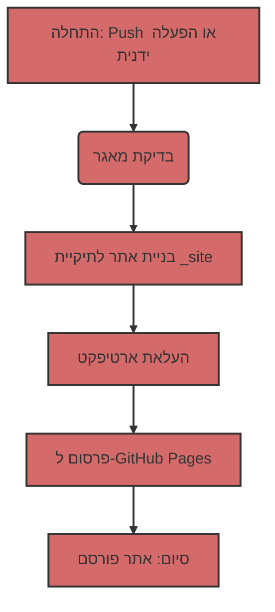

## פריסת Jekyll אוטומטית ל-GitHub Pages

כדי להפוך את תהליך הפריסה לאוטומטי, נשתמש ב-GitHub Actions, המאפשרים לבצע משימות שונות, כולל בנייה ופרסום אתרים, ישירות במאגר שלך.

### 1: סקירת קובץ Workflow
ראשית, בואו נסתכל על קובץ ה-workflow הראשי השולט בתהליך הבנייה והפריסה. קובץ זה כתוב ב-YAML ונמצא בדרך כלל בספריית `.github/workflows`. הנה תוכנו:

```yaml
# Sample workflow for building and deploying a Jekyll site to GitHub Pages
name: Deploy Jekyll with GitHub Pages dependencies preinstalled

on:
  # Runs on pushes targeting the default branch
  push:
    branches: ["master"]

  # Allows you to run this workflow manually from the Actions tab
  workflow_dispatch:

# Sets permissions of the GITHUB_TOKEN to allow deployment to GitHub Pages
permissions:
  contents: read
  pages: write
  id-token: write

# Allow only one concurrent deployment, skipping runs queued between the run in-progress and latest queued.
# However, do NOT cancel in-progress runs as we want to allow these production deployments to complete.
concurrency:
  group: "pages"
  cancel-in-progress: false

jobs:
  # Build job
  build:
    runs-on: ubuntu-latest
    steps:
      - name: Checkout
        uses: actions/checkout@v4
      - name: Setup Pages
        uses: actions/configure-pages@v5
      - name: Build with Jekyll
        uses: actions/jekyll-build-pages@v1
        with:
          source: ./docs/gemini/consultant/ru/src
          destination: ./_site
      - name: Upload artifact
        uses: actions/upload-pages-artifact@v3

  # Deployment job
  deploy:
    environment:
      name: github-pages
      url: ${{ steps.deployment.outputs.page_url }}
    runs-on: ubuntu-latest
    needs: build
    steps:
      - name: Deploy to GitHub Pages
        id: deployment
        uses: actions/deploy-pages@v4
```

### 2: פירוק מבנה Workflow
כעת נפרק כל חלק בקובץ זה:

#### 2.1. מידע כללי

-   `name: Deploy Jekyll with GitHub Pages dependencies preinstalled`: שם ה-workflow שתראה ברשימת Actions במאגר.
-   `on`: מתאר מתי ה-workflow אמור לרוץ:
    -   `push`: ה-workflow רץ בכל push לענף `master`.
    -   `workflow_dispatch`: מאפשר לך להריץ את ה-workflow ידנית דרך ממשק GitHub.
-   `permissions`: מגדיר הרשאות להפעלת ה-workflow:
    -   `contents: read`: הרשאה לקרוא קוד מהמאגר.
    -   `pages: write`: הרשאה לפרסם ב-GitHub Pages.
    -   `id-token: write`: הרשאה לקבל אסימון אימות (נדרש עבור GitHub Actions).
-   `concurrency`: מגדיר ביצוע מקביל של workflow:
    -   `group: "pages"`: מבטיח שרק workflow אחד עבור GitHub Pages ירוץ בכל פעם.
    -   `cancel-in-progress: false`: מונע ביטול של הרצת workflow נוכחית כאשר מופעלת חדשה.

#### 2.2. סעיף `jobs`
סעיף זה מתאר אילו משימות יש לבצע. יש לנו שתי משימות: `build` ו-`deploy`.

##### 2.2.1. `build`: בניית אתר
    -   `runs-on: ubuntu-latest`: מציין שהמשימה רצה על שרת עם אובונטו.
    -   `steps`: מפרט את השלבים המבוצעים במהלך הבנייה:
        -   `name: Checkout`: מוציא את קוד המקור של המאגר.
        -   `uses: actions/checkout@v4`: משתמש בפעולה מוכנה להוצאת קוד.
        -   `name: Setup Pages`: מגדיר את הסביבה לעבודה עם GitHub Pages.
        -    `uses: actions/configure-pages@v5`: משתמש בפעולה מוכנה להגדרה.
        -   `name: Build with Jekyll`: מתחיל לבנות אתר Jekyll.
        -   `uses: actions/jekyll-build-pages@v1`: משתמש בפעולה מוכנה לבנייה.
        -   `with:`: מגדיר פרמטרים לפעולה:
            -   `source: ./docs/gemini/consultant/ru/src`: מציין היכן נמצאים קבצי המקור של האתר שלך. **שים לב**: הנתיב לקבצים שלך `docs/gemini/consultant/ru/src`.
            -    `destination: ./_site`: מציין היכן למקם את הקבצים הבנויים.
        -   `name: Upload artifact`: מעלה את הקבצים הבנויים כדי להעביר אותם למשימה הבאה.
        -   `uses: actions/upload-pages-artifact@v3`: משתמש בפעולה מוכנה להעלאת ארטיפקטים.
    
##### 2.2.2. `deploy`: פרסום אתר
    -   `environment`: מגדיר את סביבת הפרסום.
        -  `name: github-pages`: שם הסביבה.
        -   `url: ${{ steps.deployment.outputs.page_url }}`: מקבל את כתובת ה-URL של האתר שפורסם.
    -   `runs-on: ubuntu-latest`: מציין שהמשימה רצה על שרת עם אובונטו.
    -   `needs: build`: מציין שהמשימה `deploy` צריכה לרוץ לאחר השלמה מוצלחת של המשימה `build`.
    -   `steps`: מפרט את השלבים המבוצעים במהלך הפרסום:
        -   `name: Deploy to GitHub Pages`: מפרסם את האתר ל-GitHub Pages.
        -   `id: deployment`: מגדיר מזהה לפעולה.
        -    `uses: actions/deploy-pages@v4`: משתמש בפעולה מוכנה לפריסה.

### 3: מה עושים קבצי Markdown?

קבצי `.md` (Markdown) הם הבסיס לאתר Jekyll. Markdown היא שפת סימון פשוטה המאפשרת לך לעצב טקסט.
Jekyll מעבד אוטומטית קבצי `.md`, והופך אותם לדפי HTML. הקבצים שלך צריכים להיות ממוקמים בתיקייה `docs/gemini/consultant/ru/src` המצוינת ב-workflow.

### 4: תרשים זרימה




### 5: איך זה עובד
1.  **שינוי קוד:** אתה מבצע שינויים בקבצי `.md` או `.html` שלך הממוקמים בתיקייה `docs/gemini/consultant/ru/src`.
2.  **Push:** אתה שולח (push) את השינויים לענף `master` של מאגר GitHub שלך.
3.  **הפעלת Workflow:** GitHub Actions מפעיל אוטומטית את ה-workflow המתואר בקובץ YAML.
4.  **בנייה:** ה-workflow מוריד תחילה את הקוד מהמאגר, ולאחר מכן בונה אתר Jekyll מקבצי המקור שלך לתיקייה `_site`.
5.  **פרסום:** האתר הבנוי מפורסם ל-GitHub Pages.
6.  **האתר מוכן:** האתר שלך זמין בכתובת ה-URL המצוינת בהגדרות GitHub Pages שלך.
