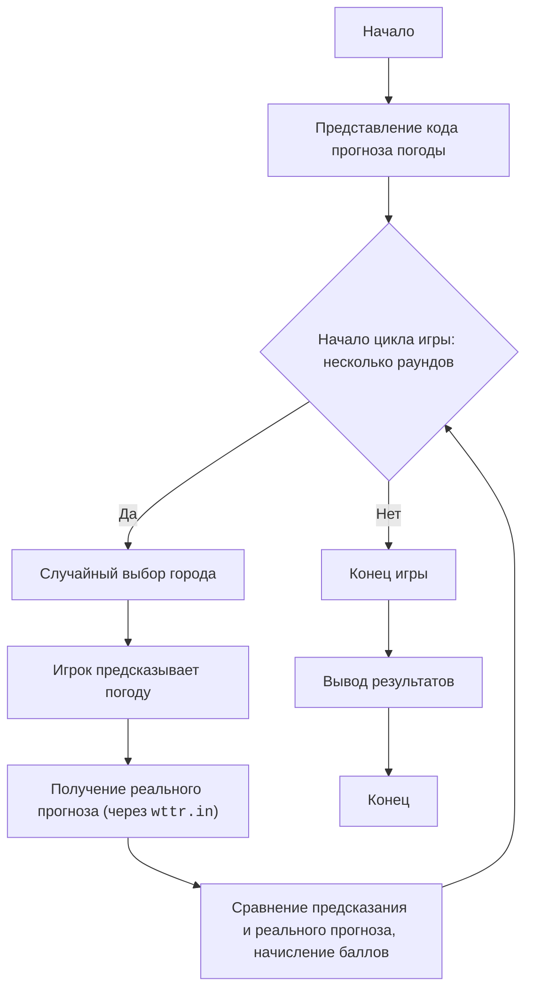

WEATHER MYSTERY:
=================
Сложность: 5
-----------------
Игра "Тайна Погоды" - это образовательная игра, которая проверяет умение игрока использовать простые инструменты для получения информации. Игрок должен предсказать или угадать погодные условия в заданном городе, основываясь на общих знаниях, а затем проверить свое предположение с помощью программы.

Правила игры:
1. Игроку случайным образом предлагается название города.
2. Задача игрока - предсказать температуру, осадки или общее состояние погоды (солнечно, пасмурно, дождь) для этого города.
3. После предсказания игрок использует программу (или её симуляцию), чтобы получить реальный прогноз погоды для этого города.
4. Игрок получает баллы за точные или близкие к истине предсказания.
5. Игра состоит из нескольких раундов, каждый раз с новым городом.
-----------------
Алгоритм:
1. **Представление кода:** Игроку демонстрируется код Python, который получает прогноз погоды с `wttr.in`.
2. **Выбор города:** Случайным образом выбирается город из заранее определенного списка.
3. **Предсказание игрока:** Игрок делает предсказание о погоде в этом городе (например, вводит температуру, осадки).
4. **Получение реального прогноза:** Игрок вводит название города в симуляцию программы, которая вызывает `requests.get()` для получения фактического прогноза погоды с `wttr.in`.
5. **Сравнение и оценка:** Предсказание игрока сравнивается с реальным прогнозом. Баллы начисляются за точность.
6. **Повторение:** Шаги 2-5 повторяются для нескольких раундов.
7. **Завершение:** Игра завершается, и выводится общее количество баллов.
-----------------
Блок-схема:

Legenda:
    Start - Начало игры.
    PresentCode - Отображение игроку кода, используемого для получения прогноза погоды.
    GameLoopStart - Начало цикла игры, который продолжается, пока не закончатся раунды.
    ChooseCity - Случайный выбор города, о погоде в котором игрок будет делать предсказание.
    PlayerPredict - Игрок делает свое предсказание о погоде.
    GetActualWeather - Программа получает реальный прогноз погоды с wttr.in.
    CompareAndScore - Сравнение предсказания игрока с реальным прогнозом и начисление баллов.
    EndGame - Конец игры.
    OutputScore - Вывод общего количества баллов.
    End - Конец программы.
"""

import requests
import random
import re

def get_weather_from_wttr(city):
    """Получает прогноз погоды для города с wttr.in."""
    url = f"https://wttr.in/{city}?format=%t+%C"  # %t - температура, %C - описание
    try:
        response = requests.get(url, timeout=5)
        response.raise_for_status()  # Вызовет исключение для статусов 4xx/5xx
        return response.text.strip()
    except requests.exceptions.RequestException as e:
        print(f"Ошибка при получении погоды для {city}: {e}")
        return "Недоступно"

def parse_weather_string(weather_str):
    """Парсит строку погоды и извлекает температуру и описание."""
    match = re.search(r'([+-]?\d+)[°C]?\s*(.*)', weather_str)
    if match:
        temp = int(match.group(1))
        description = match.group(2).strip()
        return temp, description
    return None, None

def play_weather_mystery_game():
    """Основная функция игры 'Тайна Погоды'."""
    print("Добро пожаловать в игру 'Тайна Погоды'!")
    print("Я покажу тебе код, который получает прогноз погоды:")
    print("```python")
    print("import requests")
    print("city = input('Введите название города: ')")
    print("url = f'https://wttr.in/{city}'")
    print("try:")
    print("    response = requests.get(url)")
    print("    print(response.text)")
    print("except Exception:")
    print("    print('Упс! Что-то пошло не так. Попробуйте позже.')")
    print("```")
    print("\nТвоя задача - угадать погоду в разных городах.")

    cities = ["Москва", "Лондон", "Нью-Йорк", "Токио", "Сидней", "Париж", "Рио-де-Жанейро", "Каир", "Пекин", "Берлин"]
    score = 0
    num_rounds = 3

    for round_num in range(num_rounds):
        print(f"\n--- Раунд {round_num + 1}/{num_rounds} ---")
        current_city = random.choice(cities)
        print(f"Предскажи погоду в городе: {current_city}")

        try:
            player_temp_guess = int(input("Как ты думаешь, какая температура (в °C)? "))
            player_desc_guess = input("Какое состояние погоды (например, 'ясно', 'облачно', 'дождь')? ").lower()
        except ValueError:
            print("Некорректный ввод температуры. Пожалуйста, введите целое число.")
            continue

        print(f"\nПолучаем реальный прогноз для {current_city}...")
        actual_weather_str = get_weather_from_wttr(current_city)
        actual_temp, actual_desc = parse_weather_string(actual_weather_str)
        
        if actual_temp is None:
            print(f"Не удалось получить точный прогноз для {current_city}. Пропускаем раунд.")
            continue

        print(f"Реальный прогноз: {actual_temp}°C, {actual_desc}")

        # Оценка предсказания
        temp_diff = abs(player_temp_guess - actual_temp)
        desc_match = player_desc_guess in actual_desc.lower()

        if temp_diff <= 3 and desc_match:
            print("Отлично! Ты угадал температуру с небольшой погрешностью и верно описал погоду!")
            score += 2
        elif temp_diff <= 5:
            print("Хорошо! Ты был близок к правильной температуре.")
            score += 1
        elif desc_match:
            print("Неплохо! Ты угадал состояние погоды, но температура не очень точна.")
            score += 1
        else:
            print("К сожалению, твоё предсказание не совсем точное.")

    print("\n--- Игра окончена! ---")
    print(f"Твой итоговый счёт: {score} из {num_rounds * 2} возможных баллов.")
    print("Спасибо за игру!")


if __name__ == "__main__":
    play_weather_mystery_game()

"""
**Объяснение кода игры:**

1.  **`get_weather_from_wttr(city)`**:
    *   Эта функция имитирует работу оригинального кода. Она делает HTTP-запрос к `wttr.in` для получения прогноза.
    *   Параметр `?format=%t+%C` используется для получения только температуры (`%t`) и краткого описания (`%C`), что удобно для парсинга.
    *   Включена обработка ошибок `requests`, чтобы игра не "падала" при проблемах с сетью.

2.  **`parse_weather_string(weather_str)`**:
    *   Вспомогательная функция, которая использует регулярные выражения (`re`) для извлечения числовой температуры и текстового описания из строки, полученной от `wttr.in`.

3.  **`play_weather_mystery_game()`**:
    *   **Приветствие и демонстрация кода:** В начале игры показывается упрощенная версия кода, чтобы игрок понимал, как работает базовый механизм получения погоды.
    *   **Список городов:** Определен список городов, из которых игра будет случайным образом выбирать.
    *   **Цикл раундов:** Игра проходит несколько раундов.
        *   **Выбор города:** В каждом раунде случайным образом выбирается город.
        *   **Предсказание игрока:** Игроку предлагается ввести свою версию температуры и состояния погоды.
        *   **Получение реального прогноза:** Вызывается `get_weather_from_wttr` для получения реальных данных.
        *   **Оценка предсказания:**
            *   Сравнивается разница температур (до 3°C - отлично, до 5°C - хорошо).
            *   Проверяется, содержится ли слово из предсказания игрока в реальном описании погоды.
            *   Начисляются баллы в зависимости от точности.
    *   **Итоговый счёт:** В конце игры выводится общий счёт игрока.

**Как использовать в игре (для пользователя):**

1.  **Запустите скрипт.**
2.  **Прочитайте код:** Игра покажет вам код, который будет использоваться.
3.  **Сделайте предсказание:** Для каждого нового города, который выберет игра, вам нужно будет угадать температуру и описать погоду (например, "ясно", "облачно", "дождь").
4.  **Проверьте результат:** Программа получит реальный прогноз и сравнит его с вашим предсказанием, начислив баллы.
5.  **Играйте несколько раундов:** Постарайтесь набрать как можно больше баллов, улучшая свои знания о мировой погоде!

Эта игра не только развлекает, но и обучает работе с API (хоть и упрощенно), пониманию данных и даже развивает общую эрудицию в географии и погоде.
